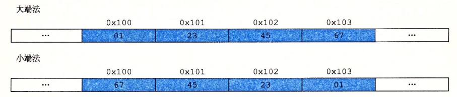
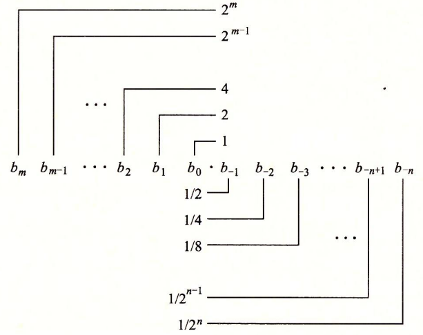
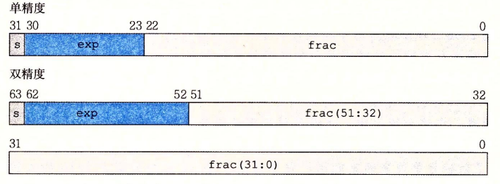
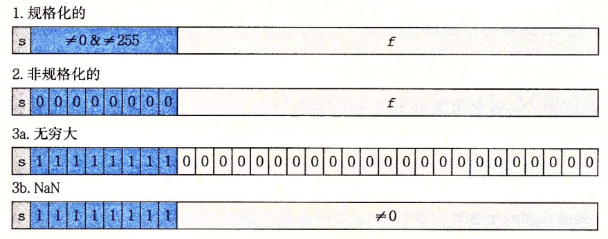

# CSAPP - 信息的表示和处理

[toc]

## **前言**

​		这一长篇的内容主要是CMU-CSAPP 第二章的内容， 主要内容是计算机对信息的存储和表示计算方式

​		对于有10个手指的人类来说，使用十进制表示法是很自然的事情，但是当构造存储和处理信息的机器时，二进制值工作得更好。

​		在自然界中，有许许多多可以表示两种状态的现象， 就比如高低电压就代表了两种状态，电流是否导通也同样代表了两种状态，我们可以令某个状态为 $1$ , 那么另一个状态即为 $0$ ， 这样我们就完整的表示了二进制中可能出现的所有数， 所以学会二进制是如何表示数据是十分重要的， 他会让我们更加准确的理解计算机的原理。


## 零零碎碎的知识


### **计算机的三种编码方式**

在计算机中，我们常用的编码方式有三种，分别对应了数学中的三种情况

* 无符号整数【正整数】  $\Rightarrow$  无符号编码
* 常数   $\Rightarrow$  补码
* 浮点数 【小数】  $\Rightarrow$  浮点数编码

我们将再后面讲解这三种方法


### **二进制于十六进制之间的转换**

​		不可否认的是， 如果我们使用二进制， 当二进制表示达到一定的长度的时候，会不利于我们阅读，为此，我们一般在阅读或者书写展示的时候会采用十六进制

一个典型的二进制转化为十六进制的代码如下：

```c++
#include<bits/stdc++.h>
using namespace std;
string put;
char info[16] = {'0','1','2','3','4','5','6','7','8','9','A','B','C','D','E','F'};
signed main()
{
	cin >> put;
	long long num = 0;
	for(int i = put.size() - 1, j = 0 ; i >= 0 ; i--, j ++)
		num += (1LL << j) * (put[i] - '0');
	string ans;
	for(; num ; num /= 16)
		ans = info[num % 16] + ans;
	ans = "0x" + ans;
	cout << ans;
	return 0;
}
```

对于一个十六进制数， 我们会在前面加上前缀 `0x`, `0X` , 字符 $A \sim F$ 可以大写也可以小写，甚至可以混用


### 虚拟内存与虚拟内存地址

​		机器级程序将内存视为一个非常大的**字节数组**，称为**虚拟内存（ virtual memory）**。内存的每个字节都由一个唯一的数字来标识，称为它的**地址（address）**，所有可能地址的集合就称为**虚拟地址空间**（ virtual address space）这些可能的地址也叫做**虚拟内存地址**

对于一个字长为 $w$ 位的机器而言，虚拟地址的范围为 $0 \sim 2^w - 1$ , 程序最多访问 $2^w$ 个字节

> 16位字长机器的地址范围：0~65535(FFFF)
>
> 32位字长机器的地址范围：0~4294967296（FFFFFFFF,4GB）
>
> 64位字长机器的地址范围：0~18446744073709551616（1999999999999998,16EB）
>


### **位 & 字节 & 字 & 字长**

* 位 (bit) 用来表示一个二进制位， 即用来表示一个 $0$ 或者一个 $1$ , 通常情况下也可以叫做比特

* 字节(byte) ， 我们通常写作 B , 一个字节由 $8$ 个位构成 ( $1$ Byte $=$ $8$ bit )

* 字 (word) 

  > 1. 计算机进行数据处理时，一次存取、加工和传送的数据长度称为字， 一个字通常由一个或多个（一般是字节的整数位）字节构成。计算机的字长决定了其CPU一次操作处理实际位数的多少。
  > 2. 系统中的一个字的大小与CPU寄存器的大小有关，因此，16位，32位系统与64位系统中的字不一样：
  >    * 16位系统：一个字 = 2Byte
  >    * 32位系统：一个字 = 4Byte
  >    * 64位系统：一个字 = 8Byte

* 字长 ： 表示计算机一个字包含多少位：

  > 一个字 = 2Byte : 16位
  >
  > 一个字 = 4Byte ： 32位


一般情况下， 64位程序都可以兼容 32 位程序，但64 位程序无法在 32 位机器上运行

同时也可以使用 gcc 指定编译的类型

```c
// 编译为 32 位程序
gcc -m32 a.c
// 编译为 64 位程序
gcc -m64 a.c
```


### **常见C语言类型大小**

|    有符号     |     无符号     | 32位 | 64位 |
| :-----------: | :------------: | :--: | :--: |
| [signed] char | unsigned char  |  1   |  1   |
|     short     | unsigned short |  2   |  2   |
|      int      |  unsigned int  |  4   |  4   |
|     long      | unsigned long  |  4   |  8   |
|    int32_t    |    uint32_t    |  4   |  4   |
|    int64_t    |    uint64_t    |  8   |  8   |
|     char*     |                |  4   |  8   |
|     float     |                |  4   |  4   |
|    double     |                |  8   |  8   |

**注意：基本C数据类型的典型大小分配的字节数是由编译器如何编译所决定的，并不是由机器位数而决定的。本表给出的是32位和64位程序的典型值**

为了避免由于依赖“典型”大小和不同编译器设置带来的奇怪行为，ISOC99引入了类数据类型，其数据大小是固定的，**不随编译器和机器设置而变化**。其中就有数据类型 int32_t 和 int64_t ，它们分别为 4 个字节和 8 个字节。**使用确定大小的整数类型是程序员准确控制数据表示的最佳途径。**


### **大端法和小端法**

* **大端**：是指数据的高字节保存在内存的低地址中，而**数据的低字节保存在内存的高地址**中，这样的存储模式有点儿类似于把数据当作字符串顺序处理：地址由小向大增加，而数据从高位往低位放。
* **小端**：是指数据的高字节保存在内存的高地址中，而**数据的低字节保存在内存的低地址**中，这种存储模式将地址的高低和数据位权有效地结合起来，高地址部分权值高，低地址部分权值低，和我们的逻辑方法一致。




### **常见位运算 & 逻辑移 & 算数移**

常见的位运算有  `&` `|` `!` `^` `~`  因为笔者用的次数超多，所以不做介绍了

一个小小的细节：

对于 `&&` 和 `||` 来说  ： 如果对第一个参数求值就能确定表达式的结果，那么逻辑运算符就不会对第二个参数求值

相反，对于 `&` 和 `|` 来说就会全部执行完毕

**左移和右移的两种方式**

逻辑左移（SHL）和算数左移(SAL)，规则相同，右边统一添0

逻辑右移(SHR)，左边**统一添0**

算数右移(SAR)，左边添加的数和符号有关 **(正数补0，负数补1)**

我们做一个简单的实验 ：

```c++
#include<bits/stdc++.h>
using namespace std;
void showBits(int num) {
	for(int i = 31 ; i >= 0 ; i--)
		cout << (num >> i & 1);
	cout << "\n";
}
signed main()
{
	int num = INT_MIN;
	showBits(num);
	showBits(num >> 1);
	showBits(num >> 10);
	return 0;
}
/*
10000000000000000000000000000000
11000000000000000000000000000000
11111111111000000000000000000000
*/
```

我们发现 C 族系都是默认是算数右移，所以有些时候会产生混乱， 所以像 JAVA 就有明确规定了

`>>` 算数右移 `>>>` 逻辑右移

**扩展：当移动位数大于实际位数时该怎么办？**

假设我们现在有一个 $32$ 位整数 $x$ ， 我们执行操作 `x >> 1234567` 

系统并不会直接将这个整数 $x$ 变成 $0$

相反的，计算机会将 $1234567$ 转化为 $1234567 \bmod 32$ ，

更一般的来讲： 对于一个 $w$ 位的数字， 移动 $k$ 位， 这个 $k$ 会被计算机隐式的转换为  $k \bmod w$


## 整数的表示

### **无符号数的编码**

无符号整数的编码是所有整数编码中最简单的

我们可以定义一个向量 $\vec{x} = [x_{w -1}, x_{w - 2}, \dots, x_0] \quad x_i \in \{0, 1\}$ 

这个向量就可以表示唯一的数 $X = \sum\limits_{i = 0}^{w - 1} x_i 2^i$

我们从数学角度不难证明出这是一个双射函数， 即一个数对应一个向量， 一个向量也对应着一个数

对于一个有 $w$ 位的无符号编码数， 他能表示的范围是 $[0, \sum\limits_{i = 0}^{w - 1} 2^i]$ 也可以写成 $[0, 2^w - 1]$


### **补码的编码**

我们接着考虑补码， 因为需要表示负数， 所以我们就需要有一个位是特殊的， 所以我们让最高位有另外的含义

我们同样定义一个向量 ：  $\vec{x} = [x_{w -1}, x_{w - 2}, \dots, x_0] \quad x_i \in \{0, 1\}$ 

这个向量对应这一个唯一的数 ： $X = -x_{w - 1} 2^{w - 1} + \sum\limits_{i = 1}^{w - 2} x_i 2^i$

同理：这个函数也是双射的，一个数对应一个向量， 一个向量也对应着一个数

对于一个有 $w$ 位的补码编码数 : 

 最大能表示的正整数为 $T_{max} = 2^{w - 1} - 1$ ， 最小能表示的负整数为 $T_{min} = -2^{w - 1}$

**关于补码需要注意的地方**

1. 补码的范围是不对称的：$|T_{min}| = |T_{max}| + 1$ ，之所以会有这样的不对称性，是因为一半的位模式（符号位设置为1的数）表示负数，而另一半（符号位设置为 $0$ 的数）表示非负数。因为 $0$ 是非负数，也就意味着能表示的整数比负数少一个。
2.  最大的无符号数值刚好比补码的最大值的两倍大一点 $U_{max} = 2\times T_{max} + 1$


### **其他整数的编码方式**

不一定只有补码这一种整数的编码方式， 还有 **反码** 和 **原码**

**反码**

除了最高有效位的权重代表 $2^{w - 1} - 1$ 外， 其他都是与补码一致的， 即： $X = -x_{w - 1} (2^{w - 1} - 1) + \sum\limits_{i = 1}^{w - 2} x_i 2^i$

**原码**

这个表示方式最符合我一开始的想法， 最高位仅仅表示正负， 剩下的位数和无符号编码方式一致

$X = x_{w - 1} \times (-1) + \sum\limits_{i = 1}^{w - 2} x_i 2^i$

这位两种方式唯一的缺点就是都表示两次 $0$ :

 对于反码来说 $11$ 和 $00$ 都表示 $0$， 对于原码来说:  $10$ 和 $00$ 都表示 $0$

也许这就是没有广泛采用的原因


### **无符号整数和补码的相互转换**

无符号编码转补码编码有专门的公式

对于满足 $0 \le u \le U_{max}$ 的 $u$ 来说
$$
T = 
\begin{cases}
\quad u \qquad \:\: u \le T_{max}\\\\
\:\: u - 2^w  \:\:\:\: u > T_{max}
\end{cases}
$$
对于补码转换为无符号数：

对于满足 $T_{min} \le t \le T_{max}$ 的 $u$ 来说
$$
U = 
\begin{cases}
\quad t \qquad \quad \: t \ge 0\\\\
\: t + 2^{w-1}  \:\:\:\: t < 0
\end{cases}
$$
 注意：当执行一个运算时，如果它的一个运算数是有符号的而另一个是无符号的，那么C语言会隐式地**将有符号参数强制类型转换为无符号数，并假设这两个数都是非负的**，来执行这个运算


**在 C 语言中的隐式转换**

在比较的时候， 即在进行 `<` , `>` , `==` ,  `!=` 的时候， 如果比较的一方是无符号整数的时候，会将有符号的一方转化为无符号数进行比较

```c++
#include<bits/stdc++.h>
signed main()
{
    cout << (INT_MIN < 0u) << "\t";
    cout << (UINT_MAX - 1 > -1) << "\t";
    cout << (UINT_MAX == -1) << "\t";
    return 0;
}
// 0       0       1
```

不难发现所有的有符号数都被转换为了无符号数


### **数字的拓展和截断**

**拓展**

​		要将一个无符号数转换为一个更大的数据类型，我们只要简单地在表示的开头添加0。这种运算被称为**零扩展**（ zero extension）。

​		要将一个补码数字转换为一个更大的数据类型，可以执行一个**符号扩展**（ sign exten sion），即扩展符号位。举个例子 :  `100000101`  $\Rightarrow$ `1111111100000101`

​	更普遍的来说， 我们只需要对一个数进行算数右移即可完成拓展

**截断**

对于无符号整数来说， 如果你要从无符号编码的第 $k$ 位开始截断， 那么这个数就会变成对 $2^{k}$ 取模后的余数

简单来说就是  $U \to U \bmod 2^k$

对于补码的截断来说， 我们采用两步， 我们先把补码转化为无符号编码，之后再视作无符号进行截断，最后再转化为补码


## 整数的运算

### **无符号编码加法**

因为无符号编码存在范围， 所以当两个数相加的时候会存在溢出的情况
$$
x + y =
\begin{cases}
\:	x + y \qquad \qquad x + y < 2^ w \\\\
x + y - 2^w \qquad 2^w \le x + y < 2^{x + 1}
\end{cases}
$$
只要溢出就要减去 $2^w$

**判断溢出的方法**

对于两个数 $x, y$ ,  $0\le x,y \le U_{max}$ , $x + y = s$ 发生溢出当且仅当 $s < x \or s < y$


### **补码编码加法**

至于补码我们就需要考虑正溢出和负溢出
$$
x + y = 
\begin{cases}
	\: x + y - 2^{w - 1} \qquad\quad x + y \ge 2^{w - 1} \\\\
	\: x+y \qquad \qquad -2^{w - 1} \le x+y < 2^{w - 1}\\\\
	\: x + y + 2^w \qquad \qquad x + y < -2^{w - 1}
\end{cases}
$$

**判断溢出的方法**

对于两个数 $x, y$ ,  $T_{min} \le x,y \le T_{max}$ , $x + y = s$ 发生溢出当且仅当 $x > 0, y > 0$ 但是 $s \le 0$ 的时候发生正溢出， 当且仅当 $x < 0, y < 0$ 但是 $s \ge 0$ 的时候发生了负溢出


### **补码的相反数**

因为补码的不对称性，所以我们认为的规定了下面的相反数规则

对于 $T_{min} \le x \le T_{max}$ 的 $x$ 
$$
-x = 
\begin{cases}
\: T_{min} \qquad \: x = T_{min}\\\\
\: -x \qquad \quad x > T_{min}
\end{cases}
$$

### **无符号编码和补码编码乘法**

与之前讲的溢出类似， 我们将最后的结果模上 $2^w$

$x \times y = (x \times y) \bmod 2^w$

对于补码来说也是同理

我们将最后乘的结果转化为无符号整数，在进行无符号的溢出操作，最后转化为补码即可


### **常数与符号数的乘法**

​		在大多数机器上，整数乘法指令相当慢，需要10个或者更多的时钟周期，然而其他整数运算（例如加法、减法、位级运算和移位）只需要1个时钟周期。因此，编译器使用了一项重要的优化，试着用移位和加法运算的组合来代替乘以常数因子的乘法。

​		我们假设要计算表达式 $14$ ， 我们就可以做如下的变换

$x \cdot 14 \Rightarrow (x << 3) + (x << 2) + (x << 1) \Rightarrow (x << 4) - (x<< 1)$ 

编译器会自己生成这两种计算方法中的任意一种，选择其中最优的执行


### **补码的除法**

  在大多数机器上，整数除法要比整数乘法更慢—需要30个或者更多的时钟周期。除以2的幂也可以用移位运算来实现，只不过我们用的是右移，而不是左移。无符号和补码数分别使用**逻辑移位**和**算术移位**来达到目的。

不过值得注意的事， 我们仅仅讨论对 $2^k$ 的除法的优化， 并且我们希望达到的效果是实现仅保留整数

对于一个无符号数来说， 我们直接右移 $k$ 位即可， 注意，这个时候我们执行的事是逻辑位移

对于一个补码编码数， 我们要分两种情况讨论， 我们假设这个数是 $x$ ， 除以 $2^k$

当 $x \ge0$ 的时候， 我们直接向右直接移 $k$ 位

当 $x < 0$ 的时候， 我们发现如果我们和大于等于 $0$ 的情况一样处理，结果和预期的不同

|  k   |   >>k [二进制表示]   | 十进制 | $(-12340)/ 2^k$ |
| :--: | :------------------: | :----: | :-------------: |
|  0   |   1100111111001100   | -12340 |    -12340.0     |
|  1   | **1**110011111100110 | -6170  |     -6170.0     |
|  4   | **1111**110011111100 |  -772  |     -771.25     |
|  8   | **11111111**11001111 |  -49   |   -48.203125    |

为了能够准确的通过右移来优化，我们提出了 **偏置** 这个概念

只要我们将这个数加上再右移，这样就可以实现我们想要的效果， 这个偏置值为 $2^k - 1$

|  k   | 偏置 |     -12340+偏置      |   >>k [二进制表示]   | 十进制 | $(-12340)/ 2^k$ |
| :--: | :--: | :------------------: | :------------------: | :----: | :-------------: |
|  0   |  0   |   1100111111001100   |   1100111111001100   | -12340 |    -12340.0     |
|  1   |  1   | 110011111100110**1** | **1**110011111100110 | -6170  |     -6170.0     |
|  4   |  15  | 110011111101**1011** | **1111**110011111100 |  -771  |     -771.25     |
|  8   | 255  | 11010000**11001011** | **11111111**11001111 |  -48   |   -48.203125    |

​		现在我们看到，除以2的幂可以通过逻辑或者算术右移来实现。这也正是为什么大多数机器上提供这两种类型的右移。不幸的是，这种方法不能推广到除以任意常数。同乘法不同，我们不能用除以2的幂的除法来表示除以任意常数K的除法。


## 浮点数的表示

### **二进制小数表示**

与整数的表示方式类似， 我们使用相同的定义来表示一个浮点数 : $F = \sum\limits_{i = -n}^m 2^i \times b_i$



但这个方法实际上是有缺陷的， 他不能精准的表示某一些小数，这在某些时候会导致严重的问题


### **IEEE 浮点表示**

IEEE浮点标准用 $V = (-1)^s \times M \times 2^E$ 来表示一个数

整个存储结构分为了三个部分

* 符号位 (sign) ： 决定这个数是正数还是负数， $1$ 表示负数， $0$ 表示正数
* 阶码（exponent）： 对浮点数加权，这个权重就是 $2^E$
* 尾数（significand）： 是一个二进制小数，实质的表示具体的值

一开始我也不理解这些概念，我举一些例子就豁然开朗了：

我们希望将 $426.41269$ 用 IEEE 浮点表示法表示：

1. 先将这个数字以小数点为分割后用二进制表示： $110101010.01101011001100110011001100110011$

   这个数字同样可以表示为 ： $1.10101010011010110011001100110011 \times 2^{8}$

   > 关于小数部分的小数，我们对 $0.41269$ 求二进制的步骤如下：
   >
   > $0.41269 \times 2 = 0.82538$ ，取整数部分 $0$，余数 $0.82538$
   >
   > $0.82538 \times 2 = 1.65076$，取整数部分 $1$，余数 $0.65076$
   >
   > $0.65076 \times 2 = 1.30152$，取整数部分 $1$，余数 $0.30152$
   >
   > $\dots$

2. 我们发现这个数是正数， 所以符号位为 $0$

3. 我们发现 $E$ 是 $8$ ，不过为了方便计算和比较，我们一般都会加上偏置然后再存储

   对于阶码为 $k$ 位的表示来说， 偏置值为 $2^{k - 1} - 1$

   对于一个 $32$ 位表示,来说， 这个偏置为 $127$ ， 所以我们要存储的十进制是 $135$, 二进制为： $10000111$

4. 对于典型的 float 来说，一共占 32 个位，所以最后表示为(我们用 `|` 来分割三个部分)

   $0|10000111|01010100110101100110011$

单精度和双精度浮点数所占的字节数不同，

单精度浮点格式（float ）$\Rightarrow$ s、exp和frac字段分别为1位、k = 8位和n = 23位，得到一个32位表示

双精度浮点格式（double） $\Rightarrow$ s、exp和frac字段分别为1位、k = 11位和n = 52位，得到一个64位表示




大家简单对上面的操作有了基本的了解以后，我们来看一下 IEEE 浮点表示法对于浮点数的三种分类：


*  当 $exp$ 的位模式不全为 $0$ （即数值不为 $0$）, 也不全为 $1$ （单精度数值为 $255$， 双精度为 $2047$） 的时候
      > 这个时候的浮点数称为规格化的值， 即一般情况下的小数
      > 
      > 这个时候， $frac$ 实际上是隐藏了开头的 $1$ 的， 如果这个时候 $frac = \{f_1, f_2, \dots, f_n\}$
      >
      > 那么尾数 $W = 1 + frac = 1 + f_1 + f_2 + \dots + f_n$
      > 
      > 其次阶码的值为 $E = e - Bias$

* 当  $exp$ 的位模式全为 $0$ （即数值为 $0$）的时候
  
  > 这个时候的浮点数被称为非规格化的值
  >
  > 这个时候的 $frac$ 不包括 $1$ , 即尾数 $W = frac = \{f_1 + f_2 + \dots + f_n\}$
  >
  > 其次阶码的值为 $E = 1 - Bias$

* 当  $exp$ 的位模式全为 $1$ （单精度数值为 $255$， 双精度为 $2047$）的时候

  > 这类的浮点数叫做特殊值
  >
  > 当 $frac = \{1,1,1,\dots , 1\}$ 的时候，即全是 $1$ , 这个时候代表无穷 $\infty$
  >
  > 当符号位为 $1$ 的时候代表 $+\infty$ ， 为 $0$ 代表 $-\infty$
  >
  > 当 $frac$ 不全是 $0$ ， 也不全是 $1$ 的时候， 代表 $NAN$ （not a number）




### 浮点数的舍入

浮点数的舍入规则其实还算比较简单，我们称这种方法为 **偶数舍入法**

首先偶数舍入法实际上是向上舍入和向下舍入的延深：

1. 如果当前数值更靠近向上舍入的数值， 那么我们就向上舍入
2. 如果当前数值更加靠经向下舍入的结果，我们就向下舍入
3. 如果刚好是在最中间，我们就舍入到尾数尾偶数的结果

我们举一些简单的例子大家就明白了：我们考虑的情况全是四位小数舍入到两位小数的结果：

> $10.00011_2$ 会舍入到 $10.00_2$
>
> $10.00110_2$ 会舍入到 $10.01_2$
>
> $10.11100_2$ 会舍入到 $11.00_2$
>
> > 向上舍入的结果为 $11.00_2$ ， 向下舍入的结果为 $10.11_2$,  他们的中间值刚好是 $10.111_2$ 
> >
> > 因为希望尾数为偶数， 所以舍入到 $11.00_2$
>
> $10.10100_2$ 会舍入到 $10.10_2$
>
> > 向上舍入的结果为 $10.11_2$ ， 向下舍入的结果为 $10.10_2$,  他们的中间值刚好是 $10.101_2$ 
> >
> > 因为希望尾数为偶数， 所以舍入到 $10.10_2$


### 浮点数的运算

> 浮点数的乘法

$$
((-1)^{s_1} \times M_1 \times 2^{E_1}) \times ((-1)^{s_2} \times M_2 \times 2^{E_2}) = (-1)^S \times M \times 2^E
$$

$S = s_1 \oplus s_2$ ;    $M = M_1 + M_2$ ;   $E = E_1 + E_2$

乘法的尾数计算过程较为复杂且有不同的舍入规则，我们不做太多的讨论

> 浮点数的加法

$$
(-1)^{s_1} \times M_1 \times 2^{E_1} + (-1)^{s_2} \times M_2 \times 2^{E_2} = (-1)^S \times M \times 2^E
$$

加法分为下面的五个步骤

- 对阶： 对齐阶码，使两数的小数点位置对齐，小阶向大阶对齐。
- 尾数求和：对阶完对尾数求和。
- 规格化：尾数必须规格化成1.M的形式。
- 舍入：由于规格化的引入，必然导致精度的损失。
- 校验判断：最后一步是校验结果是否溢出。若阶码上溢则置为溢出，下溢则置为机器零
