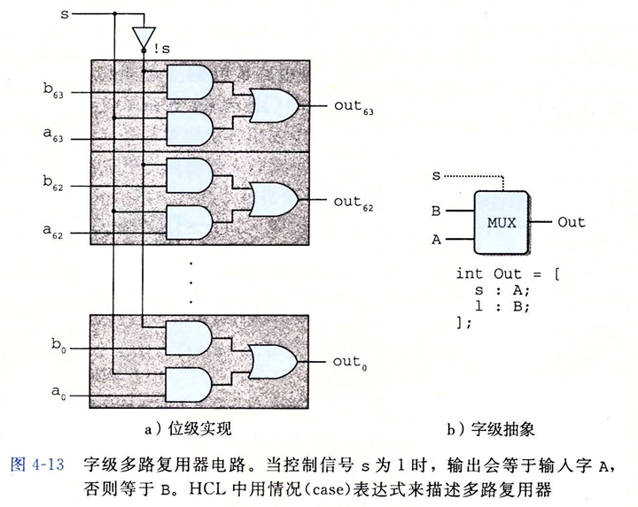

# CSAPP-处理器体系结构

## 前言

我们先简单了解一下什么是指令集体系结构 (ISA)

ISA在编译器编写者（CPU软件）和处理器设计人员（CPU硬件）之间提供了一个抽象层

- **处理器设计者**：依据ISA来设计处理器
- **处理器使用者** :依据ISA就知道CPU选用的指令集，就知道自己可以使用哪些指令以及遵循哪些规范

简单来说, ISA 规定了 CPU 如何去执行一段二进制编码, 同时也告诉哪些生成这段二进制编码的程序(如编译器)如何去生成可以被 CPU 正确解读的二进制编码.

这就是为什么同一个可执行程序在不能在不同的机器中执行的原因之一

不同的处理器家族，例如Intel IA32、IBM/Freescale PowerPC和ARM，都有不同的ISA


## Y86-64 指令集体系结构

为了更好的学习处理器的体系结构, CSAPP 原书以 X86-64 为原型进行简化, 最后命名为 Y86-64 来方便讲述


### 程序员可见的状态

注意, 这里的 "程序员" 既是使用汇编代码来写程序的人, 同时也可以是产生机器代码的编译器

Y86-64 有以下的可见单元 :


* 15个程序寄存器。每个程序寄存器存储一个 64 位的字。寄存器 %rsp 被入栈、出栈、调用和返回指令作为栈指针。

* 3个1位的条件码，它们保存着最近的算术或逻辑指令所造成影响的有关信息。

* 程序计数器（PC）存放当前正在执行指令的地址。

* 内存从概念上来说就是一个很大的字节数组，保存着程序和数据。

* 状态码Stat，表明程序执行的总体状态。它会指示是正常运行，还是出现了某种异常


### Y86-64 指令

* `movq` 指令分成了4个不同的指令：`irmovq` 、`rrmovq` 、`mrmov` 、`rmmovq` ，分别显式的指明源和目的的格式。

  > 源可以是立即数(i)、寄存器(r)或内存(m)
  >
  > 指令名字的第一个字母就表明了源的类型。目的可以是寄存器(r)或内存(m)，指令名字的第二个字母指明了目的的类型。

* 有4个整数操作指令，见下图 `OPq` 指令

  > 分别是 `addq` 、`subq` 、`andq` 和 `xorq` ，只对寄存器数据进行操作
  >
  > 这些指令会设置 3 个条件码 `ZF` 、`SF` 和 `OF`（零、符号和溢出）。

* 7个跳转指令是 `jmp` 、`jle` 、`jl` 、`je` 、`jne` 、`jge` 和 `jg` 。

* 有6个条件传送指令：`cmovle`、`cmovl`、`cmove`、`cmovne`、`cmovge` 和 `cmovg`。

* `call` 将 `call` 的下条指令地址值压到栈顶，然后将 `PC` 值设置为 `call` 后面跟的目的地址
* `ret` 将 `PC` 的设置为当前栈顶存放的值。

* `pushq` 和 `popq` 指令实现了入栈和出栈。

* `halt` 指令停止指令的执行，执行 `halt` 指令会导致处理器停止，并将状态码设置为 `HLT`


### 指令编码

对于一个完整的二进制指令编码, 前 $8$ 个 bit 就应该能分辨出对应的汇编代码的指令是哪一个

我们将这前 $8$ 个bit 分成两个部分, 分别是前 $4$ 个 bit 和 后 $4$ 个 bit

* 前 $4$ 个 bit 叫做代码 (code) 部分, 代码值为 $\mathrm{0x0\sim0xB}$ 
* 后 $4$ 个 bit 叫做功能 (function) 部分

具体的使用如下图, 这样我们就能够在前 $8$ 个 bit 就准确区分是哪个指令了


除此之外, 我们还需要对寄存器进行编号, 这样我们就可以识别我们要执行操作的寄存器具体是哪一个


值得注意的是 $\mathrm{0xF}$ : 一个二进制指令编码的第 $9 \sim 16$ 位是用来表示这条指令操作的两个寄存器的, 但有些指令是只操作一个寄存器的, 这个时候就需要将高 $4$ 位或者低 $4$ 位设置成 $\mathrm{0xF}$ 代表只有一个寄存器操作

### Y86-64 异常

对于 `Y86-64`，当遇到这些异常的时候，我们就简单地让处理器停止执行指令。在更完整的设计中，处理器通常会调用一个**异常处理程序**（exception handler），这个过程被指定用来处理遇到的某种类型的异常。

Y86-64 的异常表示是使用 `stat` 码:


## 逻辑设计和硬件控制语言 HCL

在硬件设计中，用电子电路来计算对位进行运算的函数，以及在各种存储器单元中存储位。大多数现代电路技术都是用信号线上的高电压或低电压来表示不同的位值。

要实现一个数字系统需要三个主要的组成部分：计算对位进行操作的函数的组合逻辑、存储位的存储器单元，以及控制存储器单元更新的时钟信号。

- **HCL**（Hardware Control Language，硬件控制语言），用来描述不同处理器设计的控制逻辑。
- **硬件描述语言**（Hardware Description Language，HDL）是一种文本表示，用来描述硬件结构而不是程序行为的。最常用的语言是 `Verilog` ，它的语法类似于 `C`。20 世纪 80 年代中期，研究者开发出了**逻辑合成**（logic synthesis）程序，它可以根据 HDL 的描述生成有效的电路设计，现在已经成为产生数字电路的主要技术。

HCL 语言只表达硬件设计的控制部分，只有有限的操作集合，也没有模块化。控制逻辑是设计微处理器中最难的部分。我们已经开发出了将 HCL 直接翻译成 Verilog 的工具，将这个代码与基本硬件单元的 Verilog 代码结合起来，就能产生 HDL 描述，根据这个 HDL 描述就可以合成实际能够工作的微处理器


### 逻辑门

逻辑门是数字电路的基本计算单元。它们产生的输出，等于它们输入位值的某个布尔函数。


### 组合电路和 HCL 布尔表达式

将很多的逻辑门组合成一个网，就能构建**计算块**（computational block），称为**组合电路**（combinational circuits）

组合电路有如下的几点限制 : 

* 每个逻辑门的输入必须连接到下述选项之一:

  > 1) 一个系统输入(称为主输入)
  > 2) 某个存储器单元的输出
  > 3) 某个逻辑门的输出。

* 两个或多个逻辑门的输出不能连接在一起。否则它们可能会使线上的信号矛盾，可能会导致一个不合法的电压或电路故障。

* 这个网必须是无环的。

  > 在网中不能有路径经过一系列的门而形成一个回路, 这样的回路会导致该网络计算的函数有歧义。

下面我们展示了两个非常有意思的组合电路 : 用 HCL 来写这个网的函数为 : 

```
图4-10: bool eq = (a && b) || (!a && !b)
图4-11: bool out = (s && a) || (!s && b)
```


图4-10 是简单组合电路, 而图4-11 是多路复用器（通常称为`MUX`）

多路复用器指 : 根据控制信号的值, 从一组不同的数据信号中选出一个


### 字级的组合电路和 HCL 整数表达式

​		通常，我们设计能对数据**字**（word）进行操作的电路。执行字级计算的组合电路根据输入字的各个位，用逻辑门来计算输出字的各个位。在 HCL 中，我们将所有字级的信号都声明为 `int` ，不指定字的大小。这样做是为了简单。在全功能的硬件描述语言中，每个字都可以声明为有特定的位数。

在画字级电路的时候，我们用中等粗度的线来表示携带字的每个位的线路，而用虚线来表示布尔信号结果。


HCL 表达式为 : 

```HCL
bool Eq = (A == B)
//这里的A, B 都是 int 型
```

​	字级的多路复用器电路。处理器中会用到很多种多路复用器，使得我们能根据某些控制条件，从许多源中选出一个字。在 HCL 中，多路复用函数是用**情况表达式**（expression）来描述的。选择表达式 `1` 指定默认情况。

情况表达式的通用格式如下 :

```HCL
[
	select1 : expr1;
	select2 : expr2;
	....
	select_k : expr_k;
]
```



对于我们本节的重点是**算术逻辑单元(ALU)**

**算术/逻辑单元**（ALU）是一种很重要的组合电路。这个电路有三个输入：标号为 A 和 B 的两个数据输入，以及一个控制输入。根据控制输入的设置，电路会对数据输入执行不同的算术或逻辑操作，而控制值和指令集支持的四种不同的整数操作的功能码相对应。


### 集合关系

在处理器设计中，很多时候都需要将一个信号与许多可能匹配的信号做比较，以此来检测正在处理的某个指令代码是否属于某一类指令代码。举个例子，假设想从一个 2 位信号 code 中选择高位和低位来产生四路复用器的控制信号 s1 和 s0，对应的HCL表达式：

```
bool s1 = code == 2 || code == 3;
bool s0 = code == 1 || code == 3;
```

将其写成集合关系表述就是：

```
bool s1 = code in {2, 3};
bool s0 = code in {1, 3};
```


### 存储器和时钟

组合电路从本质上讲，不存储任何信息。相反，它们只是简单地响应输入信号，产生等于输入的某个函数的输出。为了产生**时序电路**（sequential circuit），也就是有状态并且在这个状态上进行计算的系统，我们必须引入按位存储信息的设备。存储设备都是由同一个时钟控制的，时钟是一个周期性信号，决定什么时候要把新值加载到设备中。考虑两类存储器设备：

- **时钟寄存器**（简称寄存器）存储单个位或字。时钟信号控制寄存器加载输入值。
- **随机访问存储器**（简称内存）存储多个字，用地址来选择该读或该写哪个字。

在硬件和机器级编程中，“寄存器”这个词是两个有细微差别的事情：

- 在硬件中，寄存器直接将它的输入和输出线连接到电路的其他部分。
- 在机器级编程中，寄存器代表的是 CPU 中为数不多的可寻址的字，这里的地址是寄存器 ID 。


下图更详细地说明了一个硬件寄存器以及它是如何工作的。

大多数时候，寄存器都保持在稳定状态(用 $x$ 表示)，产生的输出等于它的当前状态。信号沿着寄存器前面的组合逻辑传播，这时，产生了一个新的寄存器输入(用 $y$ 表示)，但只要时钟是低电位的，寄存器的输出就仍然保持不变。当时钟变成高电位的时候，输入信号就加载到寄存器中，成为下一个状态 $y$ ，直到下一个时钟上升沿，这个状态就一直是寄存器的新输出

这就说明只有时钟上升的时候, CC, PC, Stat 和寄存器的值才会发生变化


接下来我们介绍一下 **寄存器文件**

一般情况下, 我们将我们拥有的所有寄存器集合看成一个文件, 读写都看成对文件的操作

一个典型的寄存器文件，寄存器文件有两个**读端口**（A 和 B），还有一个**写端口**（W) 。这样一个多端口随机访问存储器允许同时进行多个读和写操作。每个端口都有一个地址输入，表明该选择哪个程序寄存器。向寄存器文件写入字是由时钟信号控制的，控制方式类似于将值加载到时钟寄存器：


## Y86-64 的顺序实现

### 将处理组织成阶段

对于所有的指令, 我们都可以抽象成下面的几个阶段 : 

- **取指**（fetch）：取指阶段从内存读取指令字节，地址为程序计数器 `PC` 的值。从指令中抽取出指令指示符字节的两个四位部分，称为 `icode`（指令代码）和 `ifun`（指令功能）。它可能取出一个寄存器指示符字节，指明一个或两个寄存器操作数指示符 `rA` 和 `rB`。它还可能取出一个四字节常数字 `valC`。它按顺序方式计算当前指令的下一条指令的地址 `valP`。也就是说，`valP` 等于的 `PC` 值加上已取出指令的长度。

  > 在取指阶段, 会直接取出 $10$ 个字节, 因为取指的时候是不知道二进制指令具体的长度的, 但是一条指令最多包含 $10$ 个字节, 所以一次性取 $10$ 个字节能确保一定能完整的取出一条指令
  >
  > 【注】Y86-64是一个非常简单的指令集，所以`icode + ifun`可以用一个字节表示，如果是x86-64，肯定不止一个字节。很多RISC指令集是`32`位定长的，所以取指方式同这里的也会不一样，不过原理相同

- **译码**（decode）：译码阶段从寄存器文件读入最多两个操作数，得到值 `valA` 和/或 `valB`。通常，它读入指令 `rA` 和 `rB` 字段指明的寄存器，不过有些指令是读寄存器 `%rsp` 的。

  > 对于 `pushq` 指令, 虽然 $\mathrm{rb = 0xF}$,  但是写入栈需要知道栈指针的值, 所以还需要读取 `%rsp`

- **执行（execute）**：在执行阶段，算术/逻辑单元（ALU）要么执行指令指明的操作（根据 ifun 的值），计算内存引用的有效地址，要么增加或减少栈指针。得到的值我们称为 valE 。在此，也可能设置条件码。

  - 对一条条件传送指令来说，这个阶段会检验条件码和传送条件（由 ifun 给出），如果条件成立，则更新目标寄存器。
  - 对一条跳转指令来说，这个阶段会决定是不是应该选择分支。

- **访存**（memory）：访存阶段可以将数据写入内存，或者从内存读出数据。读出的值为 `valM`。

- **写回**（write back）：写回阶段最多可以写两个结果到寄存器文件。

- **更新 PC**（PC update）：将 `PC` 设置成下一条指令的地址。


处理器无限循环，执行这些阶段。幸好每条指令的整个流程都比较相似。因为我们想使硬件数量尽可能少，在设计硬件时，一个非常简单而一致的结构是非常重要的。降低复杂度的一种方法是让不同的指令共享尽量多的硬件

我们用下面这段代码来来实际模拟一下上面的过程 :


> 跟踪 `subq` 指令的执行
>
> 我们跟踪第 3 行中的 subq 指令。可以看到前面两条指令分别将寄存器号 `%rdx` 和号 `%rbx` 初始化成 $9$ 和 $21$。我们还能看到指令位于地址 $\mathrm{0x02a}$，由两个字节组成，值分别为 $\mathrm{0x61}$ 和 $\mathrm{0x23}$。这条指令处理的各个阶段如下表所示，左边列出了处理一个 `OPq` 指令的通用的规则，而右边列出的是对这条具体指令的计算。
>
> 
>
> 这个跟踪表明我们达到了理想的效果，寄存器号 `%rbx` 设成了 $12$，三个条件码都设成了 $0$ ，而 `PC` 加了 $2$。


> 跟踪 `rmmovq` 指令的执行
>
> 我们跟踪第 5 行 `rmmovq` 指令的处理情况。
>
> 可以看到，前面的指令已将寄存器 `%rsp` 初始化成了 $128$ ，而 `%rbx` 仍然是 `subq` 指令(第 3 行) 算出来的结果 $12$。我们还可以看到，指令位于地址 $\mathrm{0x020}$，有 $10$ 个字节。前两个的值为 $\mathrm{0x40}$ 和 $\mathrm{0x43}$，后 $8$ 个是数字 $\mathrm{0x0000000000000064}$ (十进制数 100)按字节反过来得到的数。各个阶段的处理如下 :
>
> 
>
> 跟踪记录表明这条指令的效果就是将 $128$ 写入内存地址 $112$，并将 `PC` 加 $10$

..... [其他指令自行看书或者视频]


### SEQ 硬件结构和时序

我们将整个 SEQ 硬件结构绘制在下图, 等本节全部学完可以对照进行复习


 		一个时钟变化会引发一个经过组合逻辑的流，来执行整个指令。组合逻辑电路与时序电路不同，不存储任何信息，只是简单地响应输入信号，产生符合组合逻辑的输出，如果输入信号再次更新，则输出也会跟着变化，**并不会**将先前的输出存下来，时序电路则有专门的存储设备将输出保存下来。

​		SEQ 的时序实现包括**组合逻辑**和**两种存储设备**：时钟寄存器（`PC` 和 条件码寄存器），随机访问存储器（寄存器文件，指令内存 和 数据内存）；组合逻辑不需要任何时序或控制——只要输入变化了，值就通过逻辑门网络传播。可以将读随机访问存储器看成是组合逻辑一样的操作，即当输入某个合法地址值，输出则是地址中存放的值。

​		有以下四个硬件单元的时序要进行明确的控制—— `PC`、条件码寄存器、数据内存 和 寄存器文件。这些单元通过一个时钟信号来控制，它触发将新值装载到寄存器以及将值写到随机访问存储器。每个时钟周期，`PC` 都会装载新的指令地址；只有在执行整数运算指令时，才会装载条件码寄存器；只有在执行 `rmmovq` 、 `pushq` 或 `call` 指令时，才会写数据内存；寄存器文件的两个写端口允许每个时钟周期更新两个程序寄存器，不过我们可以用特殊的寄存器 ID `0xF`作为端口地址，来表明此端口不应该执行写操作

​		要控制处理器中活动的时序，只需要寄存器和内存的时钟控制，且所有的状态的更新都只在时钟上升开始下一个周期时同时发生。保持这样的等价性要遵循一个组织计算原则：

* **从不回读** : `处理器从来不需要为了完成一条指令的执行而去读由该指令更新了的状态。`

也就是说, 如果我们执行 `pushq` 操作, 我们有两种实现方式 : 

1. 将 `%rsp` 更新为 `%rsp-8` , 接着我们读取 `%rsp` 的值并将内容写入该地址

   > 很显然这是不符合我们的原则的, 写的操作在读的操作之前, 我们要等待指令更新后才能去读

2. 使用 `ValE` 记录 `%rsp - 8` 的值, 接着同时更新 `%rsp` 和写入该地址

   > 这种方法是正确的, 它使读和写一起进行了

以下是汇编代码，SEQ硬件处理其中的3、4行指令：


​		跟踪SEQ的两个执行周期，每个周期开始时，状态单元（寄存器和内存）是根据前一条执行设置的，信号传播通过组合逻辑，创建出新的状态单元的值，在下一个周期开始时（时钟上升），这些值会被加载到状态单元。如下图中，当周期3开始时，上升前状态单元中的值是周期1组合逻辑创建，上升后状态单元被修改该为周期2组合逻辑创建；当周期3结束时，状态单元保持不变，周期四开始时（上升后），状态单元时周期3组合逻辑创建


### SEQ 各阶段的实现

建议看视频并且结合书上图片

[【CSAPP-深入理解计算机系统】4-4. Y86-64处理器硬件结构 _哔哩哔哩_  bilibili](https://www.bilibili.com/video/BV1B5411w7As)

看完可以对照上一节第一张大图进行巩固


## 流水线的通用原理