# CSAPP-存储器层次结构

## 局部性

一个编写良好的计算机程序往往有良好的**局部性**。

**局部性原理**：程序倾向于使用距离最近用过的指令/数据地址相近或相等的指令/数据。

局部性的两种形式：

- 时间局部性：最近访问过的信息，很可能在近期还会被再次访问。

- - 重复引用相同变量的程序有良好的时间局部性。

- 空间局部性：地址接近的数据项，被使用的时间也倾向于接近。

- - 对于具有步长为 $k$ 的引用模式的程序，步长越小，空间局部性越好。

```c++
int sumvec(int v[], int n) {
    int sum = 0;
    for(int i = 0 ; i < n ; i ++)
        sum += v[i];
    return sum;
}
```

对于上面的代码来说, `sum` 被反复引用, 所以用良好的时间局部性, 通常情况下会被放在 CPU 的寄存器文件中, 而对于数组 `v` 来说, 连续访问了内存的相邻区域且步长为 $1$, 所以具有良好的空间局部性


## 存储器的层次结构

存储技术和计算机软件的基本稳定特性：

- 高速存储器技术成本高、容量下、耗电大、易发热。
- CPU和主存之间的速度差距越来越大。
- 一个编写良好的程序倾向于展示出良好的局部性。

这些特性互相补充，给出一条组织存储器系统的途径——存储器层次结构。

从高层往底层走，存储器变得更慢、更便宜和更大

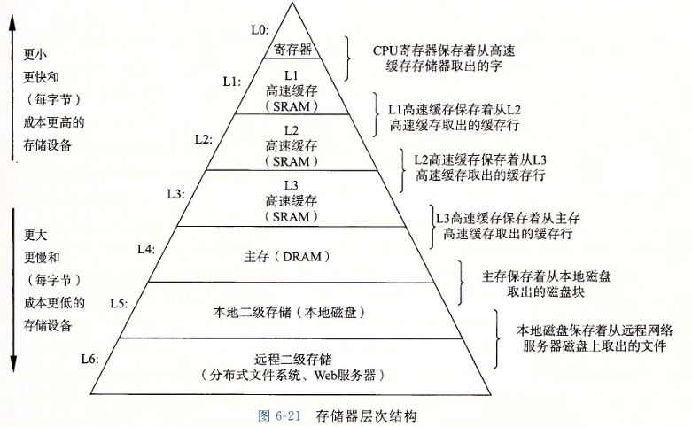

​		CPU 直接读取最底层的存储器的速度回非常的慢, 所以就提出了缓存的概念, 简单来说, 位于$k$ 层的更快更小的存储设备作为位于$k+1$ 层的更大更慢的存储设备的缓存。这样, 上层的存储器就没必要直接读取比自己低数级的存储器内容了, 大大的减少了访问的时间

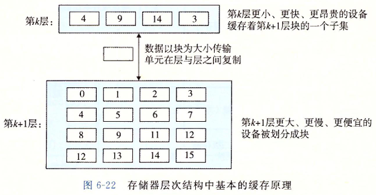

当我们想缓存请求数据的时候, 会遇到两种情况 : 

* **缓存命中**

  > 当程序需要第 $k+1$ 层的某个数据对象 $d$ 时，它首先在存储在第 $k$ 层的一个块中查找 $d$。如果 $d$ 刚好缓存在第 $k$ 层中，那么就是**缓存命中**。

* **缓存不命中**

  > 如果第 $k$ 层中没有缓存数据对象 $d$，那么就是**缓存不命中**。
  >
  > 这时需要第 $k$ 层的缓存从第 $k + 1$ 层缓存张取出包含 $d$ 的那个块 :
  >
  > * 如果 $k$ 层没有满, 那么直接放在空的地方
  > * 如果 $k$ 层满了, 那么就替换掉一个有效的块 [不同的替换策略决定替换的块]

不命中也有一下的几种类型 :

**冷不命中**（强制性不命中）：当缓存为空时，对任何数据的请求都会不命中。

**冲突不命中**：

> 大部分缓存将第 $k+1$ 层的某个块限制在第 $k$ 层块的一个子集里。
>
> 当缓存足够大，但是被引用的对象都映射到同一缓存块中。

**容量不命中**：当工作集大小超过缓存的大小时。


## 高速缓存存储器

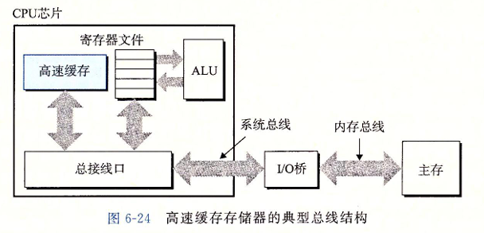

### 通用的高速缓存存储器结构

考虑一个计算机系统, 其中的存储地址有 $m$ 位, 那么就会有 $M = 2^m$ 个不同的地址, 那么这个机器的高速缓存就会组织成一个有这 $S = 2^s$ 个高速缓存组的数组, 每个组包含 $E$ 个高速缓存行, 每个行是由一个 $B = 2^b$ 字节的数据块组构成, 同时还有一个有效位和 $t = m-(b+s)$ 哥标记位, 他们唯一标识在高速缓存中的行

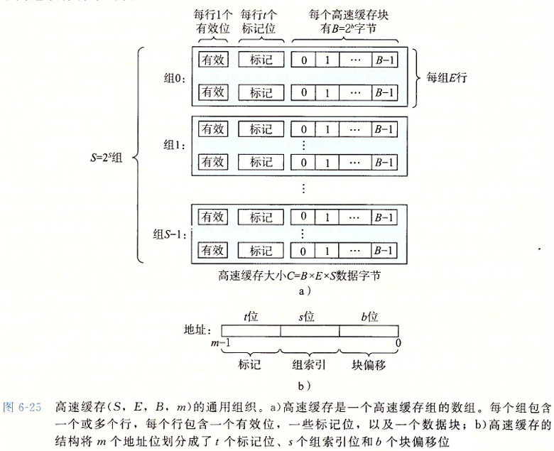

高速缓存的结构可以用元组 $(S,E,B,m)$ 来描述。高速缓存的大小（容量）$C$ 值的是所有快的大小的和。标记为和有效位不包括在内。$C=S\times E \times B$


### 直接映射高速缓存

根据每个组的高速缓存行数 $E$，高速缓存被分为不同的类。每个组只有一行 $(E=1)$ 的高速缓存称为**直接映射**高速缓存。

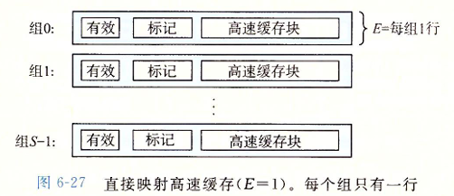

高速缓存确定一个请求是否命中，然后抽取出被请求的字的过程，分为三步：**组选择**、**行匹配**、**字抽取**。


#### 直接映射高速缓存的组选择

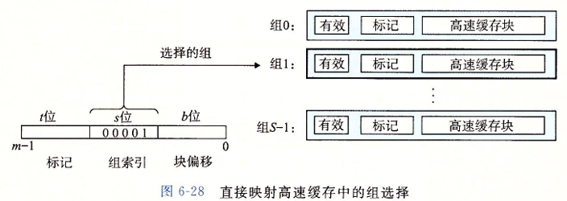

举个简单的例子 : 对于地址 $010110101$ , $s = 3$ , 选择 $3\sim 5$ 位作为组索引

那么组索引为 $110_2$  转化为 $10$ 进制为 $6$ , 那么这个地址就是选择组 $6$


#### 直接映射高速缓存的行匹配

接下来就是要确定是否有字 $w$ 的一个副本存储在组 $i$ 包含的一个高速缓存行中。

当且仅当设置了有效位，而且高速缓存行中的标记与 $w$ 的地址中的标记相匹配时，这一行中包含 $w$ 的一个副本

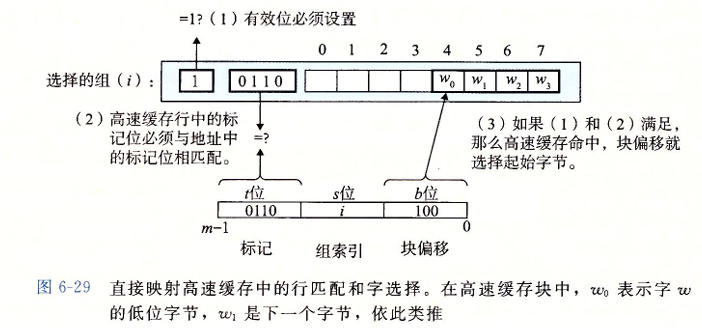


#### 直接映射高速缓存的字选择

最后一步确定需要的字在块中是从哪里开始的。块偏移位提供了所需要的字的第一个字节的偏移。我们把块看称一个字节的数组，而字节偏移是到这个数组的一个索引。

简单来说就是如果我们有地址 $010110101$, $b = 3$ , 选取 $0 \sim 2$ 为块偏移

那么块偏移为 $101_2$ , 转化为 $10$ 进制为 $5$ , 那么就从第 $5$ 个字节读取


#### 直接映射高速缓存的行替换策略

每个组只包含有一行，替换策略非常简单：用新取出的行替换当前的行。


### 组相联高速缓存

**组相联高速缓存**中的每个组都保存有多于一个的高速缓存行

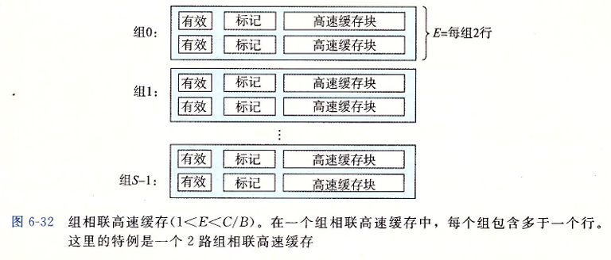


#### 组相联高速缓存的组选择和字选择

组相联高速缓存中的行匹配必须检查多个行的标记位和有效位，以确定所请求的字是否在集合中。

高速缓存必须搜索组中的每一行，寻找一个有效的行，其标记与地址中的标记相匹配。如果高速缓存找到了这样一行，那么我们就命中，快便宜从这个块中选择一个字，和前面一样。

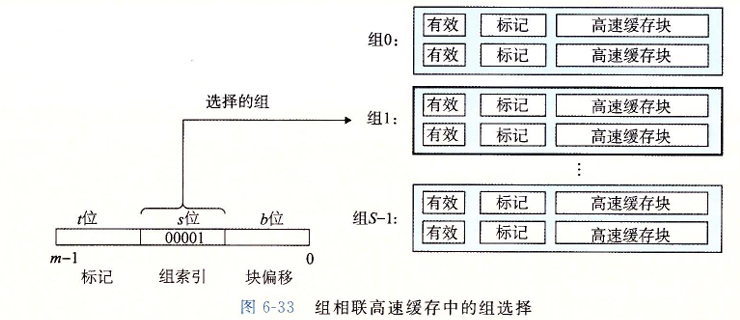

同时如果确定了行, 那么字选择也和之前一样, 这里不做赘述


#### 组相联高速缓存的行匹配

组相联高速缓存中的行匹配必须检查多个行的标记位和有效位，以确定所请求的字是否在集合中。

高速缓存必须搜索组中的每一行，寻找一个有效的行，其标记与地址中的标记相匹配。如果高速缓存找到了这样一行，那么我们就命中，快便宜从这个块中选择一个字，和前面一样。

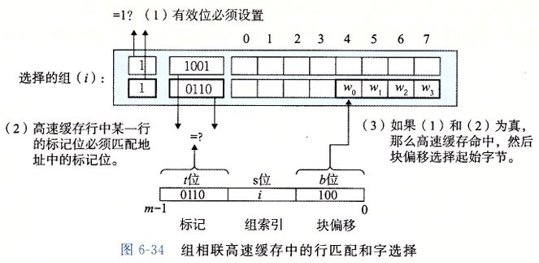


#### 组相联高速缓存行替换策略

- 如果有一个空行，则选择该空行。

- 如果没有空行：

- - 随机选择要替换的行。
  - 最近最少使用（LRU）策略会替换最后一次访问时间最久远的那一行。

除此之外, 还有许许多多的替换策略


### 全相连高速缓存

全相连高速缓存只有一个组 

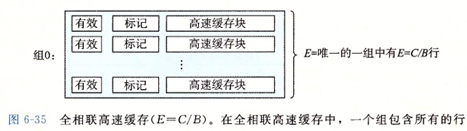


全相连高速缓存没有了组选择, 因为就只有一个组 : 同时地址也被简单分成了两个部分

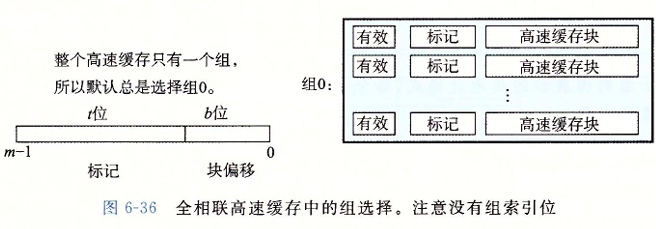

行匹配和字选择也和之前一样, 只不过规模不一样 :

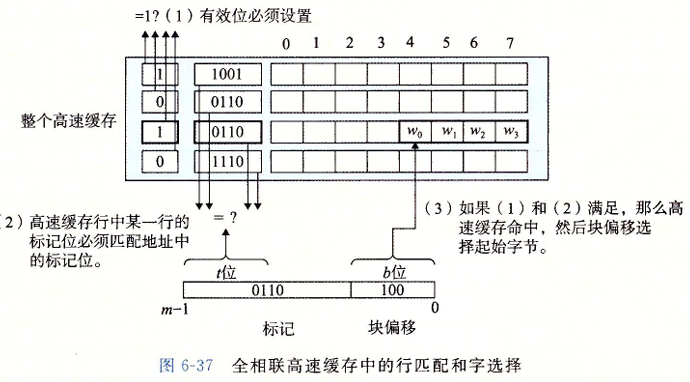

因为高速缓存电路必须并行地搜索许多相匹配的标记，构造一个又大又快的相联高速缓存很困难，而且很昂贵。因此，全相联高速缓存只适合做小的高速缓存，例如虚拟内存系统中的翻译备用缓冲器(TLB)的缓存页表项


## 关于写的问题

若我们要写一个已经缓存了的字 $w$（写命中）：

> **直写**：立即将 $w$ 的高速缓存块写回到存储器中。
>
> **写回**：推迟到缓存行要被替换时才写入内存。
>
> * 缺点是需要一个修改位。


处理**写不命中**：

> **写分配**：加载相应的缓存块到高速缓存中，更新这个高速缓存块。
>
> * 如后续有较多向该位置的写，则优势明显。
>
> **写不分配** : 直接写入主存中


典型方案：

- 直写+写不分配
- 写回+写分配
