# CSAPP-异常控制流

## 引入

从给处理器加电开始，直到你断电为止，程序计数器假设一个值的序列 : 
$$
a_0, a_1, \dots , a_{n-1}
$$
其中，每个 $a_k$ 是某个相应的指令 $I_k$ 的地址。每次从 $a_k$ 到 $a_{k+1}$ 的过渡称为控制转移(controltransfer)。这样的控制转移序列叫做处理器的控制流 (flow of control 或 control flow)。

最正常的情况是, 这些指令的地址应该是相邻的, 但某些时候会发生突变, 我们成这种突变为 **异常控制流**

异常控制流 (*Exceptional Control Flow*, `ECF`)

- 理解`ECF`将帮助你理解重要的系统概念。
- 理解 `ECF` 将帮助你理解应用程序如何与操作系统交互
  - 通过 **陷阱**(`trap`) 或者系统调用 (`system call`)的ECF形式，向操作系统请求服务。
- 理解`ECF`将帮助你编写有趣的应用程序
- 理解`ECF`将帮助你理解并发
- 理解`ECF`将帮助你理解软件异常如何工作。

我们这一章将细致的讲解 `EOF`


## 异常

### 异常的分类

异常可以分为以下几类 : `中断(interrupt)` `陷阱(trap)` `故障(fault)` `终止(abort)`

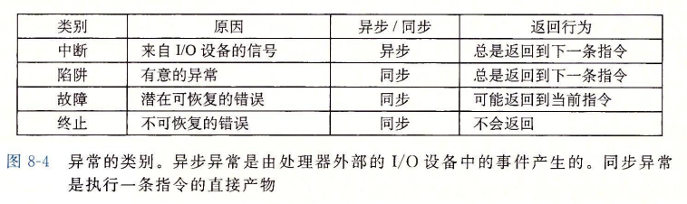

我们简单解释一下异步和同步 ：

我们先解释同步, 同步的异常是由当前指令所导致的, 也就是说是在当前序列所造成的异常

而异步不是当前指令导致的, 是由其他程序或者序列 ( 如 `I/O` 设备 ) 导致的


#### 中断 (interrupt)

- `中断`是**异步**发生，是来自处理器外部的 I/O 设备的信号的结果。
- **硬件中断**不是由任何一条专门的指令造成，从这个意义上它是异步的。
- 硬件中断的异常处理程序通常称为中断处理程序（interrupt handle）
  - I/O设备通过向处理器芯片的一个引脚发信号，并将异常号放到系统总线上，以触发中断。
  - 在当前指令执行完后，处理器注意到中断引脚的电压变化，从系统总线读取异常号，调用适当的中断处理程序。
  - 当处理程序完成后，它将控制返回给下一条本来要执行的指令。

过程图如下 :

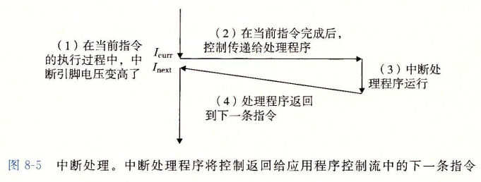


#### 陷阱 (trap) 和系统调用

​		陷阱是有意的异常，是执行一条指令的结果。就像中断处理程序一样，陷阱处理程序将控制返回到下一条指令。陷阱最重要的用途是在用户程序和内核之间提供一个像过程样的接口，叫做系统调用。

​		简单来说, 陷阱就是程序员主动去触发一个异常, 从而进入内核态从而去使用相关的程序.

​		从程序员的角度来看，系统调用和普通的函数调用是一样的。然而，它们的实现非常不同。普通的函数运行在用户模式中，用户模式限制了函数可以执行的指令的类型，而且它们只能访问与调用函数相同的栈。系统调用运行在内核模式中，内核模式允许系统调用执行特权指令，并访问定义在内核中的栈

​		相关过程图如下所示 :

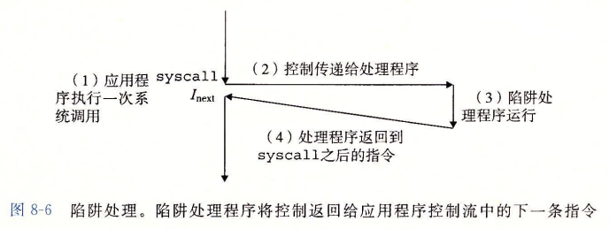

下面我们演示一下系统级调用 : 

注意 : `write` 函数和 `_exit` 函数均会产生一个异常

```c
int main()
{
    write(1, "Hello World!", 12);
    _exit(0);
}
// Hello World!
```

我们没用调用任何的库函数就实现了在控制台打印的操作


#### 故障 (fault)

​		故障由错误情况引起，它可能能够被故障处理程序修正。当故障发生时，处理器将控制转移给故障处理程序。如果处理程序能够修正这个错误情况，它就将控制返回到引起故障的指令，从而重新执行它。否则，处理程序返回到内核中的 abort 例程，abort 例程会终止引起故障的应用程序。

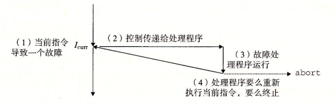


#### 终止 (abort)

- **终止**是不可恢复的致命错误造成的结果，通常是一些硬件错误，比如DRAM和SRAM被损坏。
- 终止处理程序从不将控制返回给应用程序。返回一个`abort`例程。

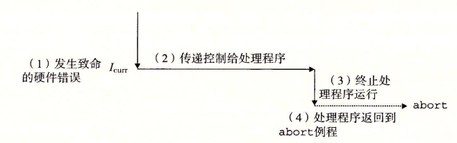

### Linux/IA32 系统中的异常

整个系统有高达 $256$ 种异常

- 0~31 由Intel架构师定义的异常，对任何 `IA32` 系统都一样。
- 23~255 对应操作系统定义的中断和陷阱。

下图展示了 `Linux x86-64` 系统常见的系统调用

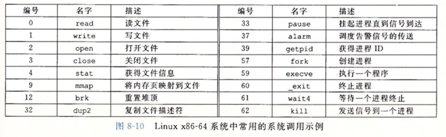

- 在 `IA32` 系统中，系统调用是通过一条称为`int n`的陷阱指令完成，其中n可能是IA32异常表256个条目中任何一个索引，历史中，系统调用是通过异常128(0x80)提供的。
- C程序可用`syscall`函数来直接调用任何系统调用
  - 实际上没必要这么做
  - C 库提供了一套方便的**包装函数**。这些包装函数将参数打包到一起，以适当的系统调用号陷入内核，然后将系统调用的返回状态传递回调用函数。
  - 我们将系统调用与他们相关联的包装函数称为**系统级函数**

我们之前演示的 `write` 函数以及 `_exit` 函数都属于系统级函数

> 所用 Linux 系统调用的参数的传递都不是通过栈而是通过寄存器来实现的

- `%eax` 包含系统调用号
- `%ebx` , `%ecx` , `%edx` , `%esi`, `%edi` ,`%ebp` 包含六个任意的参数。
- `%esp` 不能使用，进入内核模式后，内核会覆盖它。


### 异常处理

系统中可能的每种类型的异常都分配了一个唯一的非负整数的异常号(exception number)。

在系统启动时(当计算机重启或者加电时)，操作系统分配和初始化一张称为异常表的跳转表

对于每一个表项 $k$ , 都有与之对应的异常 $k$ 的处理程序的地址 

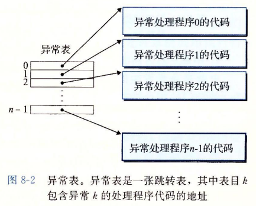

在运行时(当系统在执行某个程序时)，处理器检测到发生了一个事件，并且确定了相应推一的异常号 $k$ 。随后，处理器触发异常。接着执行间接过程调用，通过异常表的表目 $k$，转到相应的处理程序。

异常表的起始地址放在一个叫做异常表基址寄存器(exception table base register)的特殊 CPU寄存器里。


概括来说 :

触发异常产生一个异常号 

$\Longrightarrow$ 通过异常表基址寄存器确定异常表某个条目的地址

$\Longrightarrow$ 跳转至改条目中的地址, 执行里面的代码


## 进程

​		在现代系统上运行一个程序时，我们会得到一个假象，就好像我们的程序是系统中当前运行的唯一的程序一样。我们的程序好像是独占地使用处理器和内存。处理器就好像是无间断地一条接一条地执行我们程序中的指令。最后，我们程序中的代码和数据好像是系统内存中唯一的对象。这些假象都是通过进程的概念提供给我们的。

- 进程的经典定义：**一个执行中的程序实例**.
  - 系统中每个程序都是运行某个进程的 `上下文`中的。
    - 上下文是由程序正确运行所需的状态组成。
    - 这个状态包括存储器中的代码和数据，它的栈，通用目的寄存器，程序计数器，环境变量等。
- 进程提供的假象
  - 一个独立的`逻辑控制流`。
  - 一个私有的`地址空间`。


### 逻辑控制流

PC值的序列叫做`逻辑控制流`，或者简称`逻辑流`

个人觉得将其视为 Java 中的多线程来理解会更好一点, 即多个程序同时执行

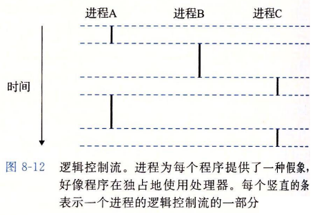

### 并发流

- `逻辑流`也有不同的形式。
  - 异常处理程序，进程，信号处理程序，线程和 Java 进程都是逻辑流的例子。
- 一个逻辑流的执行在执行上与另一个流重叠，称为`并发流`，这两个流被称为**并发地运行**。
  - 更准确地说，流 X 和 Y 互相并发。
- 多个流并发执行的一般现象称为`并发`。
  - 一个进程和其他进程轮流执行的概念称为`多任务`。
  - 一个进程执行它的控制流的一部分的每一时间段叫做`时间片`。
  - 因此，**多任务** 又叫`时间分片`
- `并发`的思想与流运行的处理器核数与计算机数无关。
  - 如果两个流在时间上重叠，即使运行在同一处理器，也是并发。
  - 并行流是并发流的一个真子集。
    - 两个流并发地运行在不同的处理器核或者计算机上，我们称为`并行流`。
    - 它们并行地运行，且并行地执行

> 解释一下 **并发** 和 **并行**
>
> 并发 : 多个任务在同一个 CPU 内核中运行
>
> 并行 : 多个任务分别在不同的 CPU 内核中运行


### 私有地址空间

​		进程也为每个程序提供一种假象，好像它独占地使用系统地址空间。在一台 $n$ 位地址的机器上，地址空间是 $2^n$ 个可能地址的集合。进程为每个程序提供它自己的私有地址空间。一般而言，和这个空间中某个地址相关联的那个内存字节是不能被其他进程读或者写的, 从这个意义中来说, 这个地址空间是私有的

​		尽管和每个私有地址空间相关联的内存的内容一般是不同的，但是每个这样的空间都有相同的通用结构。比如，图 8-13 展示了一个 `x86-64 Linux` 进程的地址空间的组织结构。地址空间底部是保留给用户程序的，包括通常的代码、数据、堆和栈段。

​		代码段总是从地址 `0x400000` 开始。地址空间顶部保留给内核(操作系统常驻内存的部分)。地址空间的这个部分包含内核在代表进程执行指令时(比如当应用程序执行系统调用时)使用的代码、数据和栈

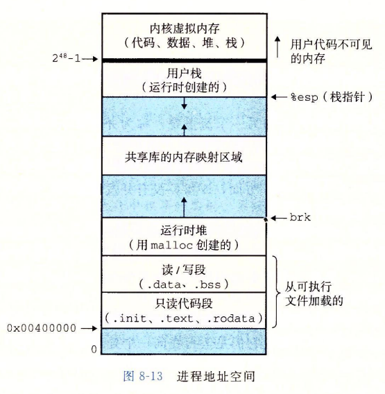

### 用户态和内核态

处理器提供一种机制，限制一个应用程序可以执行的指令以及它可以访问的地址空间范围。这就是`用户模式`和`内核模式`。

处理器通过控制寄存器中的一个`模式位`来提供这个功能。该寄存器描述了进程当前享有的特权。

设置了`模式位`后，进程就运行在内核模式中(有时也叫`超级用户模式`) , 内核模式下的进程可以执行指令集的任何指令，访问系统所有存储器的位置。

没有设置 `模式位` 时，进程运行在用户模式。用户模式不允许程序执行特权指令。

- 停止处理器，改变模式位，发起一个I/O操作。

- 不允许用户模式的进程直接引用地址空间的内核区代码和数据。

任何尝试都会导致`保护故障`。


用户通过`系统调用`间接访问内核代码和数据, 即通过中断，故障，陷入系统调用这样的异常。

在异常处理程序中会进入内核模式。退出后，又返回用户模式。

Linux 提供一种聪明的机制，叫`/proc`文件系统。允许用户模式访问内核数据结构的内容。

`/proc` 文件将许多内核数据结构输出为一个用户程序可以读的文本文件的层次结构。如CPU类型

我们可以执行以下指令来获取 CPU 的相关信息 :

```
[Linux] > cat cpuinfo
```


### 上下文切换

​		内核为每个进程维持一个上下文(context)。上下文就是内核重新启动一个被抢占的进程所需的状态。它由一些对象的值组成，这些对象包括通用目的寄存器、浮点寄存器、程序计数器、用户栈、状态寄存器、内核栈和各种内核数据结构，比如描述地址空间的页表、包含有关当前进程信息的进程表，以及包含进程已打开文件的信息的文件表。

​		在进程执行的某些时刻，内核可以决定抢占当前进程，并重新开始一个先前被抢占的进程。这种决定叫做**调度**(`shedule`),由内核中称为**调度器**(`scheduler`)的代码处理的

​		当执行系统调用的时候或者触发了异常都有可能触发上下文中断, 下图展示两个进程的上下文切换过程

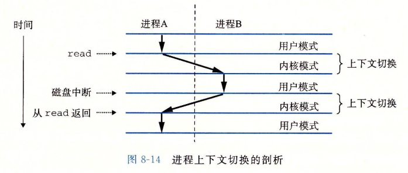


## 进程控制

### 获取进程的 `pid`

我们有如下两个方法来获得进程号 `pid`

```c
#include<sys/types.h>
#include<unistd.h>

pid_t getpid(void); // 返回调用进程的 pid
pid_t getppid(void); // 返回它父进程的pid
```

> 值得注意的是, 在 `Window` 系统中, 是不可以使用 `getppid` 的, 因为在库中是无法找到该函数的
>
> 但是在 `Window` 下, `getpid` 是可以使用的, `Linux` 系统下两个都可以使用


### 进程的状态

进程总是处于下面三种状态

- 运行。进程要么在CPU中执行，要么等待执行，最终被内核调度。

- 停止。进程的执行**被挂起**，且不会被调度。

  > 收到`SIGSTOP`,`SIGTSTP`,`SIDTTIN`或者`SIGTTOU`信号，进程就会停止。
  >
  >  直到收到一个`SIGCONT`信号，在这个时刻，进程再次开始运行。
  >
  >  `信号`是一种**软件中断**的形式。

- 终止。进程永远停止。

  > 收到一个信号。信号默认行为是终止进程。
  >
  > 从主程序返回
  >
  > 调用exit函数
  >
  > * `exit` 函数以`status退出状态`来终止进程（另一种设置方式在 `main` 中 `return`  )


### 进程的创建

我们使用 `fork()` 函数来创建进程

```c
#include<sys/types.h>
#include<unistd.h>

pid_t fork(void);
// 返回：子进程返回0，父进程返回子进程的PID，如果出错，返回-1；
```

​		新创建的子进程几乎但不完全与父进程相同。子进程得到与父进程用户级虚拟地址空间相同的(但是独立的)一份副本，包括代码和数据段、堆、共享库以及用户栈。子进程还获得与父进程任何打开文件描述符相同的副本，这就意味着当父进程调用 `fork` 时，子进程可以读写父进程中打开的任何文件。父进程和新创建的子进程之间最大的区别在于它们有不同的 `PID`

​		`fork` 函数是有趣的(也常常令人迷惑)，因为它只被调用一次，却会返回两次 : 一次是在调用进程(父进程)中，一次是在新创建的子进程中。在父进程中，`fork` 返回子进程的 `PID`。在子进程中，`fork` 返回 $0$。因为子进程的 `PID` 总是为非零，返回值就提供一个明确的方法来分辨程序是在父进程还是在子进程中执行。

我们来看看下面的代码

```c
#include<sys/types.h>
#include<unistd.h>
#include<stdio.h>
int main()
{
    int x = 1;
    pid_t pid = pid = fork();
    if(pid == 0) {
        printf("child is %d\n", ++x);
        _exit(0);
    }
    printf("parent is %d\n", --x);
    _exit(0);
}

// child is 2
// parent is 0
```

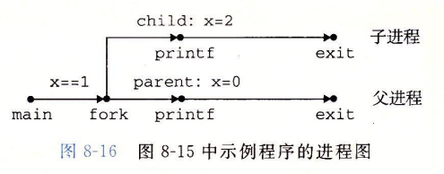

### 回收子进程

​		当一个进程由于某种原因终止时，内核并不是立即把它从系统中清除。相反，进程被保持在一种已终止的状态中，直到被它的父进程回收(reaped)。当父进程回收已终止的子进程时，内核将子进程的退出状态传递给父进程，然后抛弃已终止的进程，从此时开始.该进程就不存在了。一个终止了但还未被回收的进程称为**僵死进程** (zombie)。

我们使用 `waitpid()` 函数来等待或者终止他的子进程执行

```c
#include <sys/types.h> 
#include <sys/wait.h>

pid_t waitpid(pid_t pid,int *status,int options);
```

如果在调用waitpid()函数时，当指定等待的子进程已经停止运行或结束了，则waitpid()会立即返回；但是如果子进程还没有停止运行或结束，则调用waitpid()函数的父进程则会被阻塞，暂停运行。

我们来看看每一个参数的意义

**pid_t pid**

|     pid     |                             说明                             |
| :---------: | :----------------------------------------------------------: |
| pid  $< -1$ |            等待进程组号为pid绝对值的任何子进程。             |
| pid  $= -1$ | 等待任何子进程，此时的waitpid()函数就退化成了普通的wait()函数。即等待父进程的所有子进程 |
|  pid $= 0$  | 等待进程组号与目前进程相同的任何子进程，也就是说任何和调用waitpid()函数的进程在同一个进程组的进程。 |
|  pid $> 0$  |                  等待进程号为pid的子进程。                   |

**int *status**

这个参数将保存子进程的状态信息

有了这个信息父进程就可以了解子进程为什么会退出，是正常退出还是出了什么错误。如果status不是空指针，则状态信息将被写入

当然，如果不关心子进程为什么退出的话，也可以传入空指针。

Linux提供了一些非常有用的宏来帮助解析这个状态信息，这些宏都定义在 `sys/wait.h` 头文件中。主要有以下几个：

|         宏          |                             说明                             |
| :-----------------: | :----------------------------------------------------------: |
|  WIFEXITED(status)  |         如果子进程正常结束，它就返回真；否则返回假。         |
| WEXITSTATUS(status) | 如果WIFEXITED(status)为真，则可以用该宏取得子进程exit()返回的结束代码。 |
| WIFSIGNALED(status) | 如果子进程因为一个未捕获的信号而终止，它就返回真；否则返回假。 |
|  WTERMSIG(status)   | 如果WIFSIGNALED(status)为真，则可以用该宏获得导致子进程终止的信号代码。 |
| WIFSTOPPED(status)  |        如果当前子进程被暂停了，则返回真；否则返回假。        |
|  WSTOPSIG(status)   | 如果WIFSTOPPED(status)为真，则可以使用该宏获得导致子进程暂停的信号代码。 |

**int options**

参数 `options` 提供了一些另外的选项来控制waitpid()函数的行为。如果不想使用这些选项，则可以把这个参数设为0。

主要使用的有以下两个选项：

|   参数    |                             说明                             |
| :-------: | :----------------------------------------------------------: |
|  WNOHANG  | 如果pid指定的子进程没有结束，则waitpid()函数立即返回0，而不是阻塞在这个函数上等待；如果结束了，则返回该子进程的进程号。 |
| WUNTRACED |             如果子进程进入暂停状态，则马上返回。             |

如果调用进程没有子进程，那么 `waitpid` 返回-1，并且设置 errno为 ECHILD。如果 waitpid函数被一个信号中断，那么它返回-1，并设置 errno为 EINTR。

我们来看看下面的实例代码 :

```c
#include<sys/types.h>
#include<sys/wait.h>
#include<unistd.h>
#include<stdio.h>
const int N = 5;
int main()
{
    pid_t pid;
    int status, i;
	
    // parent create N children
    for(i = 0; i < N ; i ++) {
        if((pid = fork()) == 0)
            _exit(i);
    }
	// parent reaps N children in no particular order
    while((pid = waitpid(-1, &status, 0)) > 0) {
        if(WIFEXITED(status))
            printf("child %d terminated normally with exit code : %d\n",
                   pid, WEXITSTATUS(status));
        else
            printf("child %d terminated abnormally\n", pid);
    }
    _exit(0);
}
```

运行的结果为 :

```
child 79135 terminated normally with exit code : 0
child 79136 terminated normally with exit code : 1
child 79137 terminated normally with exit code : 2
child 79138 terminated normally with exit code : 3
child 79139 terminated normally with exit code : 4
```


### 进程休眠

```c
#include<unistd.h>
unsigned int sleep(unsigned int secs);
```

​		如果请求的时间量已经到了，`sleep` 返回 `0`，否则返回还剩下的要休眠的秒数。后一种情况是可能的，如果因为 `sleep` 函数被一个信号中断而过早地返回。我们将在后面详细讨论信号。
我们会发现另一个很有用的函数是 `pause` 函数，该函数让调用函数休眠，直到该进程收到一个信号。

```c
#include<unistd.h>
int pause(void)
```


## 运行程序

`execve` 函数在当前进程的上下文中加载和运行一个新的程序

```c
#include<unistd.h>
int execve(const char* filename, const char* argv[],
           const char* envp[]);
```

> `filename` : 表示可执行文件的程序名
>
> `argv` : 表示执行程序所需要的参数列表
>
> `envp` : 表示环境变量列表

假设我们要执行命令 : `ls -lt /home/caspp` 时, 我们可以画出结构图 :

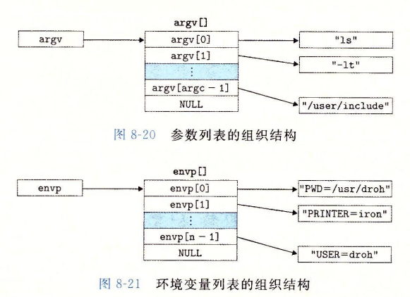

值得注意的是, 我们自己写的原代码编译后也是一个可执行文件, 也可以被加载运行

其中 `main` 函数有如下两个原型 : 

```c
int main(int argc,char **argv,char **envp);
int main(int argc,char *argv[],char *envp[]);
```

开始执行后, 用户栈为 :

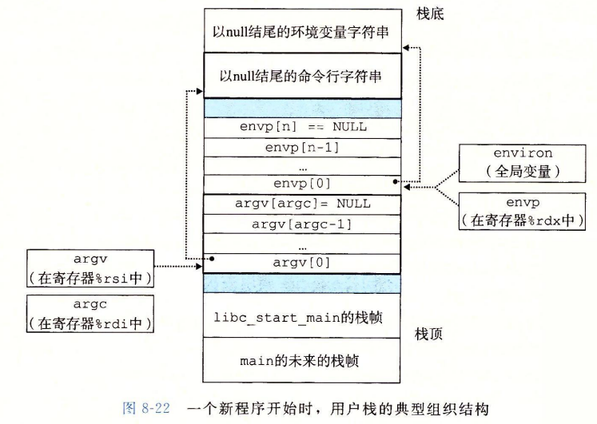

Unix提供一下**几个函数**来操作环境数组。

- `getenv`

  ```c
    #include<stdlib.h>
    char *getenv(const char *name);
    //getenv函数在环境变量搜索字符串“name=value"。如果找到了，它就返回一个指向value的指针，否则返回NULL。
  ```

- `setenv` 和 `unsetenv`

  ```c
    #include<stdlib.h>
    int setenv(const char *name,const char *newvalue,int overwrite);
    //成功返回0，错误返回-1
    void unsetenv(const char *name);
    
    //如果环境数组包含一个形如"name=oldvalue"的字符串，那么unsetenv会删除它
    //，而setenv会用newvalue代替oldvalue,但是只有在overwirte非零时才会这样。
    //如果name不存在，那么setenv就把”name=newvalue"添加进指针数组。
  ```

------

`fork`与`execve`区别

- `fork` :在新的子进程运行相同的程序。
  - 新进程是父进程的复制品。
- `execve` : 在当前进程的上下文加载并运行一个新的程序。
  - 覆盖当前进程的地址空间。
  - 但没有创建新进程。
  - 新的程序仍然有相同的`PID`,并且继承了调用`execve`函数时已打开的所有文件描述。

我们举下面的例子, 因为输出较多,我们截取一部分 :

```c
#include<unistd.h>
#include<stdio.h>
void info_print(char* name, char** arg) {
	int i;
	for(i = 0 ; arg[i] != 0 ; i ++)
		printf("%s[%2d]: %s\n", name, i, arg[i]);
}
int main(int argc,char *argv[],char *envp[])
{
	printf("main program info : \n");
	info_print("argv", argv);
	info_print("envp", envp);
	execve("./use", 0, 0); // 单独执行 use 会输出 Hello
	write(1, "No arrive\n", 10);
	_exit(0);
}
```

结果为 :

```
[Linux] > ./prog
main program info : 
argv[ 0]: ./prog
envp[ 0]: XDG_SESSION_ID=18
envp[ 1]: HOSTNAME=student.rjxy.com
....
envp[25]: OLDPWD=/root/csapp
Hello
```


## 信号

正常情况下, 异常都是由底层的硬件来处理, 对于程序员来说一般都是不可见的, 为了让程序员能够更好的进行控制, 就有了信号的概念, 它允许进程中断其他进程。

一个**信号**就是一条小消息，它通知进程系统中发生一个某种类型的事件

`Linux` 支持 $30$ 多种信号, 如下图所示 :


一些信号示例如下 :

- 底层的信号。
  - 当底层发生硬件异常，**信号**通知 **用户进程** 发生了这些**异常**。
    - 除以 $0$：发送`SIGILL`信号。
    - 非法存储器引用：发送`SIGSEGV`信号
  - 较高层次的软件事件
    - 键入ctrl+c:发送`SIGINT`信号
    - 一个进程可以发送给另一个进程`SIGKILL`信号强制终止它。
    - 子进程终止或者停止，内核会发送一个`SIGCHLD`信号给父进程。


### 发送信号

#### 进程组

每个进程都只属于一个进程组，进程组是由一个正整数进程组 ID 来标识的。

`getpgrp` 函数返回当前进程的进程组 ID:

```c
#include <unistd.h>
pid_t getpgrp(void);
```

默认地，一个子进程和它的父进程同属于一个进程组。

一个进程可以通过使用 `setpgid` 函数来改变自已或者其他进程的进程组

```c
#include<unistd.h>
int setpgid(pid_t pid, pid_t pgid);
```

`setpgid` 函数将进程 `pid` 的进程组改为 `pgid`。如果 `pid` 是 $0$ 那么就使用当前的 `PID` 。如果 `pgid` 是 $0$ ，那么就用 `pid` 指定的进程的 `PID` 作为进程组`ID`


#### /bin/kill 程序发送信号

`/bin/kill`可以向另外的进程发送**任意的信号**。

```
[Linux] > /bin/kill -9 15213
```

发送信号 $9$ 给进程 $15213$ 

一个为负的 `PID` 会导致信号被发送到进程组 `|PID|` 中的每个进程

```
[Linux] > /bin/kill -9 -15213
```

这里使用绝对地址, 因为可能有些电脑的地址不同, 注意修改, 如 `CentOs` 为 `/usr/bin/kill`


#### 使用键盘发送信号

我们引入作业(job) 的概念 : 对一个命令行求值而创建的**进程**。

在任何时候至多只有一个**前台作业**和0个或多个**后台作业**

- 前台作业就是需要等待的
- 后台作业就是不需要等待的

假设我们输入命令 `ls | sort`

* 创建一个两个进程组成的**前台作业**。

* **两个进程**通过 `Linux 管道`链接。

`shell`为每个作业创建了一个独立的进程组, 进程组ID取自作业中父进程中的一个

在**键盘**输入`ctrl-c` 会发送一个`SIGINT`信号到外壳。外壳捕获该信号。然后发送`SIGINT`信号到这个前台进程组的每个进程。在默认情况下，结果是**终止**前台作业

输入`ctrl-z`会发送一个`SIGTSTP`信号到外壳，外壳捕获这个信号，并发送`SIGTSTP`信号给前台进程组的每个进程，在默认情况，结果是**停止(挂起)**前台作业(还是僵死的)

下面是 Linux Shell 的作业图 :

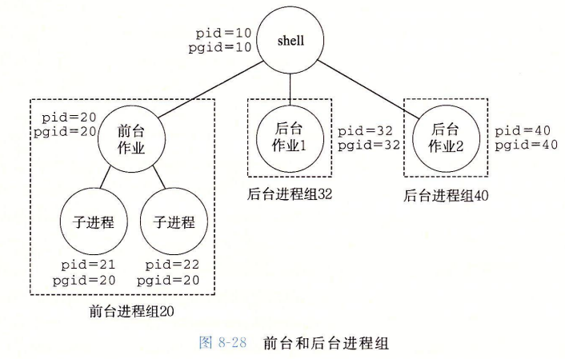


