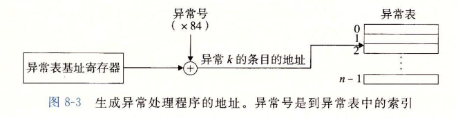

# CSAPP-异常控制流

## 引入

从给处理器加电开始，直到你断电为止，程序计数器假设一个值的序列 : 
$$
a_0, a_1, \dots , a_{n-1}
$$
其中，每个 $a_k$ 是某个相应的指令 $I_k$ 的地址。每次从 $a_k$ 到 $a_{k+1}$ 的过渡称为控制转移(controltransfer)。这样的控制转移序列叫做处理器的控制流 (flow of control 或 control flow)。

最正常的情况是, 这些指令的地址应该是相邻的, 但某些时候会发生突变, 我们成这种突变为 **异常控制流**

异常控制流 (*Exceptional Control Flow*, `ECF`)

- 理解`ECF`将帮助你理解重要的系统概念。
- 理解 `ECF` 将帮助你理解应用程序如何与操作系统交互
  - 通过 **陷阱**(`trap`) 或者系统调用 (`system call`)的ECF形式，向操作系统请求服务。
- 理解`ECF`将帮助你编写有趣的应用程序
- 理解`ECF`将帮助你理解并发
- 理解`ECF`将帮助你理解软件异常如何工作。

我们这一章将细致的讲解 `EOF`


## 异常

### 异常的分类

异常可以分为以下几类 : `中断(interrupt)` `陷阱(trap)` `故障(fault)` `终止(abort)`


我们简单解释一下异步和同步 ：

我们先解释同步, 同步的异常是由当前指令所导致的, 也就是说是在当前序列所造成的异常

而异步不是当前指令导致的, 是由其他程序或者序列 ( 如 `I/O` 设备 ) 导致的


#### 中断 (interrupt)

- `中断`是**异步**发生，是来自处理器外部的 I/O 设备的信号的结果。
- **硬件中断**不是由任何一条专门的指令造成，从这个意义上它是异步的。
- 硬件中断的异常处理程序通常称为中断处理程序（interrupt handle）
  - I/O设备通过向处理器芯片的一个引脚发信号，并将异常号放到系统总线上，以触发中断。
  - 在当前指令执行完后，处理器注意到中断引脚的电压变化，从系统总线读取异常号，调用适当的中断处理程序。
  - 当处理程序完成后，它将控制返回给下一条本来要执行的指令。

过程图如下 :


#### 陷阱 (trap) 和系统调用

​		陷阱是有意的异常，是执行一条指令的结果。就像中断处理程序一样，陷阱处理程序将控制返回到下一条指令。陷阱最重要的用途是在用户程序和内核之间提供一个像过程样的接口，叫做系统调用。

​		简单来说, 陷阱就是程序员主动去触发一个异常, 从而进入内核态从而去使用相关的程序.

​		从程序员的角度来看，系统调用和普通的函数调用是一样的。然而，它们的实现非常不同。普通的函数运行在用户模式中，用户模式限制了函数可以执行的指令的类型，而且它们只能访问与调用函数相同的栈。系统调用运行在内核模式中，内核模式允许系统调用执行特权指令，并访问定义在内核中的栈

​		相关过程图如下所示 :


下面我们演示一下系统级调用 : 

注意 : `write` 函数和 `_exit` 函数均会产生一个异常

```c
int main()
{
    write(1, "Hello World!", 12);
    _exit(0);
}
// Hello World!
```

我们没用调用任何的库函数就实现了在控制台打印的操作


#### 故障 (fault)

​		故障由错误情况引起，它可能能够被故障处理程序修正。当故障发生时，处理器将控制转移给故障处理程序。如果处理程序能够修正这个错误情况，它就将控制返回到引起故障的指令，从而重新执行它。否则，处理程序返回到内核中的 abort 例程，abort 例程会终止引起故障的应用程序。


#### 终止 (abort)

- **终止**是不可恢复的致命错误造成的结果，通常是一些硬件错误，比如DRAM和SRAM被损坏。
- 终止处理程序从不将控制返回给应用程序。返回一个`abort`例程。


### Linux/IA32 系统中的异常

整个系统有高达 $256$ 种异常

- 0~31 由Intel架构师定义的异常，对任何 `IA32` 系统都一样。
- 23~255 对应操作系统定义的中断和陷阱。

下图展示了 `Linux x86-64` 系统常见的系统调用


- 在 `IA32` 系统中，系统调用是通过一条称为`int n`的陷阱指令完成，其中n可能是IA32异常表256个条目中任何一个索引，历史中，系统调用是通过异常128(0x80)提供的。
- C程序可用`syscall`函数来直接调用任何系统调用
  - 实际上没必要这么做
  - C 库提供了一套方便的**包装函数**。这些包装函数将参数打包到一起，以适当的系统调用号陷入内核，然后将系统调用的返回状态传递回调用函数。
  - 我们将系统调用与他们相关联的包装函数称为**系统级函数**

我们之前演示的 `write` 函数以及 `_exit` 函数都属于系统级函数

> 所用 Linux 系统调用的参数的传递都不是通过栈而是通过寄存器来实现的

- `%eax` 包含系统调用号
- `%ebx` , `%ecx` , `%edx` , `%esi`, `%edi` ,`%ebp` 包含六个任意的参数。
- `%esp` 不能使用，进入内核模式后，内核会覆盖它。


### 异常处理

系统中可能的每种类型的异常都分配了一个唯一的非负整数的异常号(exception number)。

在系统启动时(当计算机重启或者加电时)，操作系统分配和初始化一张称为异常表的跳转表

对于每一个表项 $k$ , 都有与之对应的异常 $k$ 的处理程序的地址 


在运行时(当系统在执行某个程序时)，处理器检测到发生了一个事件，并且确定了相应推一的异常号 $k$ 。随后，处理器触发异常。接着执行间接过程调用，通过异常表的表目 $k$，转到相应的处理程序。

异常表的起始地址放在一个叫做异常表基址寄存器(exception table base register)的特殊 CPU寄存器里。



概括来说 :

触发异常产生一个异常号 

$\Longrightarrow$ 通过异常表基址寄存器确定异常表某个条目的地址

$\Longrightarrow$ 跳转至改条目中的地址, 执行里面的代码


## 进程

