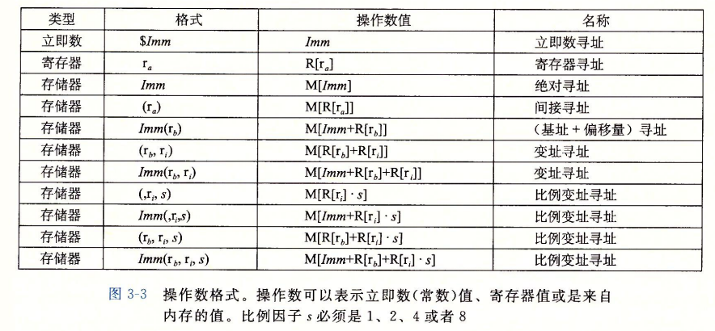
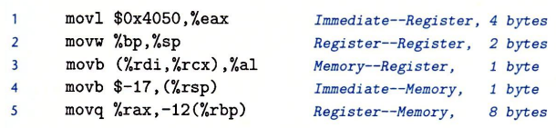

# CSAPP-程序的机器级表示

[toc]

## 前言

​		在我们的日常生活中， 我们编写程序最常使用的语言大概率会是 `C`, `C++`, `Java`, `Go`, `python` 这些高级语言，但是实际上计算机并不能直接的理解我们所编写的程序，计算机能理解的是一个个由 `0`, `1` 构成的字节序列， 为了理解计算机的底层原理， 我们如果根一个个字节序列打交道的化不免会觉得头痛， 所以我们在这一章中主要会于汇编语言 “眉来眼去”.....所以让我们一起走进汇编的世界吧


## 程序编译过程

我们简单的了解一下一个 C 语言程序是如何被编译为一个二进制程序的：

在 Linux 系统中， `gcc` 是默认的 `C/C++` 编译器， 除此之外他也是一个非常常用的编译器， 我们假设现在有一个 C 语言的程序 `hello.c`，我们编译的代码为 ：

```linux
gcc hello.c
```

或者我们指定特定的优化等级

```linux
gcc -Og -S hello.c
gcc -O1 -S hello.c
gcc -O2 -S hello.c
```

> **优化等级**
>
> 我们在本章使用的优化等级均为 `-Og`
>
> * `-Og` ： 这个命令告诉编译器生成符合原始 C 代码整体架构的机器代码
>
> 如果我们使用 `-O1` 或者 `-O2` 会使我们不容易阅读反汇编的代码
>
> 不过在实际生产中 `-O1`, `-O2` 的优化效率比 `-Og` 要好

在调用 `gcc` 的编译指令后， gcc会调用一系列指令群，将 `#include` 指定的文件插入，并且拓展所有的 `#define` 声明定义的宏

接着汇编器会将文本文件转化为机器代码，它包含所有的指令的二进制表示，但还没有填写全局值得地址

最后连链接器实现对于库函数得合并，最后得到最终得可执行代码


## 机器代码以及反汇编

对于计算机级得编程来说， 有两种非常重要得抽象

* 指令集体系结构或指令集架构抽象

  > 封装了机器级程序得格式和行为，定义了处理器状态，指令格式等等

* 将内存地址抽象为虚拟地址

  > 机器级程序将内存视为一个巨大的字节数组

就如同 C 语言对于底层细节的封装一样，机器代码也是得益于对上面的两种抽象，才能更好的执行指令

汇编代码表示非常接近于机器代码，主要特点是更加的易读

区别于 C 语言， 汇编代码对程序员可见的部分有 ：

* **程序计数器** ：（表示为 `PC`， 在 x86-64 表示为 `%rip`），表示下一条指令在内存中的地址
* **整数寄存器** ：（一共有 $16$ 个这样的 $64$ 位寄存器）,用来存储地址或整数数据，用于临时保存
* **条件码寄存器**：保存最近的执行的算术逻辑，用来实现逻辑控制
* **一组向量寄存器** : 用来存放一个或者多个整数和浮点数值


### 如何生成一个汇编代码

假设我们现在有这样一个 C 语言程序 `mul.c`

```c
void mul(long a, long b, long* ans) {
    * ans = a * b;
}
int main()
{
    long tem = 0;
    mul(100, 70, &tem);
}
```

如果我们想要得到这个代码的汇编代码形式，我们可以用如下 `gcc` 的命令

```
gcc -Og -S mul.c
```

`-S` 代表产生一个汇编文件 `mul.s` ， 如同如下的形式：

```assembly
	.file	"mul.c"
	.text
	.globl	mul
	.type	mul, @function
mul:
.LFB0:
	.cfi_startproc
	imulq	%rsi, %rdi
	movq	%rdi, (%rdx)
	ret
	.cfi_endproc
.LFE0:
	.size	mul, .-mul
	.globl	main
	.type	main, @function
main:
.LFB1:
	.cfi_startproc
	subq	$16, %rsp
	.cfi_def_cfa_offset 24
	movq	$0, 8(%rsp)
	leaq	8(%rsp), %rdx
	movl	$70, %esi
	movl	$100, %edi
	call	mul
	addq	$16, %rsp
	.cfi_def_cfa_offset 8
	ret
	.cfi_endproc
.LFE1:
	.size	main, .-main
	.ident	"GCC: (GNU) 4.8.5 20150623 (Red Hat 4.8.5-44)"
	.section	.note.GNU-stack,"",@progbits
```

汇编代码中所有以 `.` 开头的行都是指导汇编器和链接器工作的伪指令,  我们去掉后就可以看到主要的代码逻辑

```assembly
mul:
	imulq	%rsi, %rdi
	movq	%rdi, (%rdx)
	ret
main:
	movq	$0, 8(%rsp)
	leaq	8(%rsp), %rdx
	movl	$70, %esi
	movl	$100, %edi
	call	mul
	addq	$16, %rsp
	ret
```

### 反汇编

但是有些时候我们只有一个可运行的文件，我们到底怎么才能明白其中的逻辑呢？

我们就可以使用 **反汇编工具**

对于上面的程序， 如果我们直接用 `gcc` 编译的话， 我们可以得到一个 `a.out` 的可执行文件

我们可以通过下面的指令来得到反汇编的结果

```
objdump -d a.out 
```

我们截取其中关于函数的一部分来看看：

```
00000000004004ed <mul>:
  4004ed:	48 0f af fe          	imul   %rsi,%rdi
  4004f1:	48 89 3a             	mov    %rdi,(%rdx)
  4004f4:	c3                   	retq   

00000000004004f5 <main>:
  4004f5:	48 83 ec 10          	sub    $0x10,%rsp
  4004f9:	48 c7 44 24 08 00 00 	movq   $0x0,0x8(%rsp)
  400500:	00 00 
  400502:	48 8d 54 24 08       	lea    0x8(%rsp),%rdx
  400507:	be 46 00 00 00       	mov    $0x46,%esi
  40050c:	bf 64 00 00 00       	mov    $0x64,%edi
  400511:	e8 d7 ff ff ff       	callq  4004ed <mul>
  400516:	48 83 c4 10          	add    $0x10,%rsp
  40051a:	c3                   	retq   
  40051b:	0f 1f 44 00 00       	nopl   0x0(%rax,%rax,1)
```

可以发现，这和我们之前生成的汇编语言有异曲同工之妙

左边是对应的字节序列，右边则是等价的汇编代码

值得注意的是：反编译是直接用过字节序列来分析得出的汇编代码，是不会也不能分析源文件的


## 寄存器一览表


这张表只是让大家对寄存器的名字以及主要用途有个简单的了解，具体的我们后面会说


## 操作数指示符

我们将操作数分为以下的三种 ：

* 立即数 : 以 `$` 后面跟着一个整数表示， 如 `$0x34` 或者 `$-5434`
* 寄存器 ： 表示寄存器的内容
* 内存引用 : 根据计算的有效地址访问某个内存位置

常见的寻址模式 ：




## 数据传送指令

`MOV` 指令一览


- **源操作数指定的值是一个立即数，存储在寄存器种或内存中**
- **目的操作数为内存位置or寄存器**
- **x86-64的限制：传送指令的两个操作数不能都指向内存位置**

movl 指令以寄存器作为目的时，会把该寄存器的高位4字节设置为0， 而对于其他 `mov` 指令，则不会修改他们的高位

对于常规的 `MOV` 指令，操作的字节数随计算机改变而改变， 所以我们可以通过类似 `movabsq` 来明确规定转移的字节数

**movabsq**指令能够以任意**64位立即数**作为源操作数，并且只能以**寄存器**作为目的

> `MOV` 指令的使用以及寻址方法实例



除此之外，还有拓展数字位数的操作

**无符号整数拓展**


**有符号整数拓展**


## 压入和弹出栈操作

栈的结构与运行模式都与计算机底层的逻辑相符合

栈主要有两种操作， 放入栈 `pushq` ， 弹出栈 `popq` 

栈指针是 `%rsp` , 每次压入栈指针会减少 $8$ ，紧接着再放入元素，如果是弹出元素， 那么就将栈指针直接增加 $8$


## 算数和逻辑操作

所有的算数逻辑操作都有四种变种，代表操作的字节数的不同，与 `MOV` 类相同，不做演示


## 汇编实现控制

### 条件码

除了整数寄存器， CPU 还替我们自动维护了一个条件码寄存器，记录着最近的算数和逻辑运算是否符合某些条件

最常用的条件码有 ：

* `CF` ： 进位标志，最近的操作使最高位的位数有所增加，可以用来判断是否溢出
* `ZF` ： 零标志， 最近的操作得到的结果是 $0$
* `SF`： 符号标志： 最近的操作得到的结果为负数
* `OF` ： 溢出标志： 最近的操作导致了一个补码溢出， 包括真溢出和负溢出


除了上面我们提到的算数和逻辑操作， 还有两种操作可以影响条件码

他们分别是 `CMP` 和 `TEST` 指令， 他们只会修改条件码，而不会修改原来的值


### 访问条件码

条件码寄存器一般不能直接读取，我们使用条件码常见的方式有三种

* 根据条件码的组合，将一个字节设为 $0$ 或 $1$
* 根据条件跳转程序的另一个地方
* 可以有条件的传送数据

我们先介绍第一种方式， 我们使用 `SET` 指令


我们简单演示以下如何使用条件码来进行比较：

```assembly
cmp:
	cmpq  %rsi %rdi 
	setl  %al
	movzbl  %al %eax
	ret
```


### 跳转指令

跳转指令分为 ：**直接跳转** 和 **间接跳转**：

* 直接跳转的跳转目标是作为指令的一部分编码的（ `jmp .L1`）
* 间接跳转跳转目标是从寄存器或内存位置中读出的（ `jmp *(%rax)`）


注意：**条件跳转只能是直接跳转**

- 执行pc相对寻址时，程序计数器的值是跳转指令后面的那条指令的地址。而不是跳转指令本身的地址


### 汇编实现条件分支

#### 使用条件控制实现条件分支

我们在 C 语言中实现条件分支的方式就是使用 `if-else` 方式，我们考虑下面这个函数

```c
int aLarge = 0, bLarge = 0;
long absDiff(long a, long b) {
    long result = 0;
    if(a > b) {
        aLarge ++; result = a - b;
    }else {
        bLarge ++; result = b - a;
    }
    return result;
}
```

但实际上，汇编语言的实现与 `goto` 的版本更像一点，虽然 `goto` 写法是一个非常不好的代码风格，但是对于我们理解汇编代码的实现有着不俗的作用， 所以我们附上 `goto` 版本的实现

```c
int aLarge = 0, bLarge = 0;
long absDiffUseGOTO(long a, long b) {
    if(a > b)
        goto other;
    bLarge ++; return b - a;
other:
    aLarge ++; return a - b;
}
```

而条件分支的汇编实现如下所示：

```assembly
// a in %rdi, b in %rsi
absDiff:
	cmpq %rsi %rdi
	jge .L2
	addq $1 aLarge(%rip)
	movq %rsi %rax
	subq %rdi %rax
	ret
.L2:
	addq $1 bLarge(%rip)
	movq %rdi %rax
	subq %rsi %rax
	ret
```

发现实际上和 `goto` 版本的实现有异曲同工之妙， 类似的，大家也可以实现其他的条件分支语句


#### 使用条件传送来实现条件分支

我们首先要了解处理器是如何提高效率的才能更好的理解这一个部分的用意

​		处理器为了能够更好的提升效率， 采用流水线的模式， 所以对于条件分支语句来说，因为做逻辑算数运算可能会涉及读写内存的操作， 回导致效率变慢，所以计算机实际上不会等逻辑判断运行完，而是直接运行下面的代码，直到逻辑判断的结果得到，才会丢弃另一个分支的值

​		举个例子，之前的 `absDiff` 函数， 哪怕要进入 `.L2` ， 后面的 `addq $1 aLarge(%rip)`  等等指令都可能被执行，从而浪费时间

​		为此， CPU 引入了一种分支预测手段，即猜测逻辑运算的结果，大部分情况下都是可以预测正确的，但是也有预测效率非常低下的情况，如果预测错误， 将会带来许许多多的多余时间，所以有些时候为了避免这种情况， 于是就可以使用条件传送来实现条件分支

​		我们先来看看一些指令， 他们都是根据不同的条件码来判断是否要执行 `MOV` 操作


我们简单演示一下，对于之前的 `absDiff` 函数， 我们可以写成如下的形式， 这个形式实际上和条件传送非常相近：

```c
long absDiffByCondition(long a, long b) {
    long tem1 = a - b;
    long tem2 = b - a;
    long c = a > b;
    if(c) tem2 = tem1;
    return tem2;
}
```

我们为了方便展示， 没有实现 `aLarge` 和 `bLarge` 的增加操作

上面代码对应的汇编代码是 ：

```assembly
// a in %rdi, b in %rsi
absDiffByCondition:
	movq %rsi %rax
	subq %rdi %rax
	movq %rdi %rdx
	subq %rsi %rdx
	cmpq %rsi %rdi
	cmovge %rdx %rax
	ret
```

可以发现, 这段代码没有 `JUMP` 指令了， 这样代码的实际利用率就达到了 100%， 从而提高了效率

要注意的是条件传送只有在一定的条件下才可以使用，因为他是计算了两个分支的值，如果分支中有别的作用，就会导致错误，这时候只能使用条件控制分支


### 汇编实现循环控制

#### do - while 循环

`do-while` 的 C 语言格式为：

```c
do {
    循环体
} while(条件)
```

对应的汇编格式为 

```assembly
function:
	语句...
	JUMP function // 通过条件码判断跳转
```

举个例子：

```c
long fact_do(long n) {
    long result = 1;
    do {
		result *= n;
		n = n-1;
    } while (n > 1);
    return result;
}
```

对应的汇编代码为：

```assembly
fact_do:
	movl	$1, %eax
.L2:
	imulq	%rdi, %rax
	subq	$1, %rdi
	cmpq	$1, %rdi
	jg	.L2
	rep; ret
```


#### while 循环

`while` 的 C 语言格式为：

```c
while (条件)
    循环语句
```

翻译为汇编代码有两种形式，分别为 `jump to middle` 和 `guarded-do`

* `jump to middle`

  ```assembly
  JUMP test
  loop:
  	循环语句
  test:
  	t = 测试条件
  	JUMP loop // 根据测试条件判断时候跳转
  ```

* `guarded-do`

  ```assembly
  t = 测试条件
  JUMP done
  loop:
  	循环语句
  	t = 测试条件
  	JUMP loop // 根据条件判断是否跳转
  done
  ```

  简单来说就是先判断条件是否成立， 不成立直接结束， 之后转化为 `do-while` 格式

举个例子：

```c
long fact_while(long n) {
    long result = 1;
    while (n > 1) {
		result *= n;
		n = n-1;
    }
    return result;
}
```

对应的汇编代码为：

```assembly
// jump to middle
fact_while:
	movl	$1, %eax
	jmp		.L5
.L6:
	imulq	%rdi, %rax
	subq	$1, %rdi
.L5:
	cmpq	$1, %rdi
	jg		.L6
	rep; ret
// guarded-do
fact_while_gd_goto:
	cmpq	$1, %rdi
	jle		.L23
.L21:
	movl	$1, %eax
.L22:
	imulq	%rdi, %rax
	subq	$1, %rdi
	cmpq	$1, %rdi
	jne		.L22
	rep; ret
.L23:
	movl	$1, %eax
.L20:
	ret
```

通常情况下 `guarded-do` 会更优秀一点


#### for 循环

`for` 循环的 C 语言格式为 ：

```c
for(初始化 ; 判断条件 ; 更新操作)
    循环语句
```

`for` 语句可以转换为 `while` 语句， 从而实现两种汇编的翻译方法

```c
初始化
while (判断条件)
    循环语句
    更新条件
```

具体的汇编代码不做演示了


#### switch 语句

`switch` 语句的 C 语言格式为：

```c
switch {
    case 1:
        语句
        break;
    ....
    default:
        语句
}
```

为了更好的理解，我们以下面的代码为例子：

```c
void switch_eg(long x, long n, long *dest) { 
    long val = x; 
    switch (n) { 
    	case 100: 
			val *= 13; 
			break; 
		case 102: 
			val += 10; 
			/* Fall through */ 
		case 103: 
			val += 11; 
			break; 
    	case 104: 
    	case 106: 
			val *= val; 
			break; 
    	default: 
			val = 0;       
    } 
    *dest = val; 
} 
```

我们将上述的代码改写为 `goto` 的版本， 值得注意的是 `&&` 是用来取标签的地址

在 `goto` 版本中，我们实际上是构建了一张表， 根据数值来确定位置

```c
void switch_eg_impl(long x, long n, long *dest) {
     /* Table of code pointers */
     static void *jt[7] = { //line:asm:switch_jumptable
		&&loc_A, &&loc_def, &&loc_B,
		&&loc_C, &&loc_D, &&loc_def,
		&&loc_D
     }; 
    unsigned long index = n - 100; 
    long val; 
     if (index > 6)
		goto loc_def; 
    /* Multiway branch */
     goto *jt[index]; //line:asm:switch:c_jump

     loc_A:    		/* Case 100 */ 
        val = x * 13; 
        goto done;
     loc_B:    		/* Case 102 */
        x = x + 10;
        /* Fall through */
     loc_C:    		/* Case 103 */
        val = x + 11;
        goto done;
     loc_D:    		/* Cases 104, 106 */ 
        val = x * x;
        goto done;
     loc_def:  		/* Default case */
        val = 0;
     done:
        *dest = val;
} 
```

对应的汇编代码为 ：

```assembly
switch_eg:
	subq	$100, %rsi          #   Compute index = n-100
	cmpq	$6, %rsi	        #   Compare index:6
	ja	.L8 		            #   If >, goto loc_def
	jmp	*.L4(,%rsi,8)           #   Goto *jt[index]

.L4:
	.quad	.L3	 # Case 100: loc_A
	.quad	.L8	 # Case 101: loc_def
	.quad	.L5	 # Case 102: loc_B
	.quad	.L6	 # Case 103: loc_C
	.quad	.L7	 # Case 104: loc_D
	.quad	.L8	 # Case 105: loc_def
	.quad	.L7	 # Case 106: loc_D

.L3:	  		                    #   loc_A
	leaq	(%rdi,%rdi,2), %rax     #   3*x
	leaq	(%rdi,%rax,4), %rdi     #   val = 13*x
	jmp	.L2                         #   Goto done
.L5:				                #   loc_B
	addq	$10, %rdi               #   x = x + 10
.L6:		     		            #   loc_C
	addq	$11, %rdi	   			#   val = x + 11
	jmp	.L2  		    			#   Goto done
.L7:				    			#   loc_D:}
	imulq	%rdi, %rdi	    		#   val = x * x
	jmp	.L2   		    			#   Goto done
.L8:				    			#   loc_def
	movl	$0, %edi	    		#   val = 0
.L2:		    		    		#   done
	movq	%rdi, (%rdx)	    	#   *dest = val
	ret	      		    			#   Return
```

我们发现，如果当 `case` 的值非常接近的时候，我们是可以使用这种构建表的方式来达到快速访问的，这也是为什么 switch 在部分情况下比 `if-else` 要优秀的原因

但是如果 `case` 值过于分散， 构建一个 $O(1)$ 的访问表已经不现实了， 所以编译器的实现方法是将数值从小到大排序， 之后二分寻找这个值


## 运行时的过程

### 运行时的栈

相关的机制（假设过程P调用过程Q）

* 传递控制：在进入过程Q的时候，程序计数器必须被设置成Q的代码的起始地址，然后在返回时，要把程序计数器设置为P中调用Q后面那条指令的地址
* 传递数据：P必须能够向Q提供一个或多个参数，Q必须能够向P返回一个值
* 分配和释放内存：在开始时，Q可能需要为局部变量分配空间，而在返回前，又必须释放这些存储空间

- 过程需要的存储空间超出寄存器能够存放的大小时，就会在栈上分配空间，这个部分称为过程的栈帧
- 通过寄存器，过程P可以传递最多6个整数值，超出6个则P可以在调用Q之前在自己的栈帧里存储好这些参数


### 转移控制

这一部分主要是教大家如何调用其他的函数


- CALL指令将返回地址压入栈中，并将PC设置为Q的起始地址
- RET指令从栈中弹出地址，并把PC设置为返回地址

如果是反编译，会将 `call` 转变为 `callq` ， 代表是 `x86`


### 数据传送

x86-64中寄存器最多可以传递6个整型参数，**寄存器的使用有特殊的顺序（背下面的表）**，寄存器的名字取决于要传递的数据类型的大小


如果函数的参数大于6个，超过部分通过栈来传递

参数7~n放在栈上，**参数7位于栈顶**，通过栈传递参数，**所有数据大小都向8的倍数看齐**（参数位于调用者的参数构造区中）

考虑下面的 C 语言代码：

```c
void proc(long  a1, long*  a1p,
          int   a2, int*   a2p,
          short a3, short* a3p,
          char  a4, char*  a4p) {
    *a1p += a1;
    *a2p += a2;
    *a3p += a3;
    *a4p += a4;
}
```

转化为汇编为：

```assembly
/*
    void proc(a1, ap, a2, a2p, a3, a3p, a4, a4p)
    Arguments passed as follows :
    	a1  in %rdi		(64 bits)
    	a1p in %rsi		(64 bits)
    	a2 	in %edx		(32 bits)
    	a2p in %rcx		(64 bits)
    	a3	in %r8w		(16 bits)
    	a3p in %r9		(64 bits)
    	a4 	at %rsp+8	( 8 bits)
    	a4p at %rsp+16	(64 bits)
*/
proc:
	movq	16(%rsp), %rax
	addq	%rdi,	(%rsi)
	addl	%edx, 	(%rcx)
	addw	%r8w,	(%r9)
	movl	8(%rsp),	%edx
	addb	%dl,	(%rax)
	ret
```


### 栈上的局部存储

有三种情况必须要在栈上存储空间

* 寄存器不足够存放所有的本地数据
* 对一个局部变量使用地址运算符 `&`，因此必须能够为它产生一个地址
* 某些局部变量是数组或结构，因此必须能够通过数组或结构引用被访问到

我们考虑下面的 C 语言代码

```c
long call_pos() {
    long x1 = 1; int x2 = 2;
    short x3 = 3; char x4 = 4;
    proc(x1, &x1, x2, &x2, x3, &x3, x4, &x4);
    return (x1 + x2) * (x3 - x4);
}
```

它的汇编代码表示为：

```assembly
call_pos:
	subq	$88, %rsp  		# 分配栈帧
	movl	$1, 76(%rsp)	# 将参数 1 存到栈中，位置为 %rsp + 76 
	movl	$2, 72(%rsp)	# 将参数 2 存到栈中，位置为 %rsp + 72 
	movw	$3, 70(%rsp)	# 将参数 3 存到栈中，位置为 %rsp + 70 
	movb	$4, 69(%rsp)	# 将参数 4 存到栈中，位置为 %rsp + 69 
	leaq	76(%rsp), %rdx	# 计算 %rsp + 76 的地址，即 &x1，并存放在 %rdx 中
	leaq	69(%rsp), %rax	# 计算 %rsp + 69 的地址，即 &x4，并存放在 %rax 中
	movq	%rax, 56(%rsp)  # 将 %rsp + 56 的值设为 %rax 的值，即将 &x4 的值存贮在 %rsp + 56
	movl	$4, 48(%rsp)	# 设置 %rsp + 48 的位置的值为 4
	leaq	70(%rsp), %rax	# 计算 %rsp + 70 的地址，即 &x3，并存放在 %rax 中
	movq	%rax, 40(%rsp)	# 将 %rax 的值存储到 %rsp + 40
	movl	$3, 32(%rsp)	# 设置 %rsp + 32 的位置的值为 3
	leaq	72(%rsp), %r9	# 计算 %rsp + 72 的地址，即 &x2，并存放在 %r9 中
	movl	$2, %r8d		# 设置 %r8d 的位置的值为 2
	movl	$1, %ecx		# 设置 %ecx 的位置的值为 1
	/*
		所以我们最后得到各个参数的位置为：
		x1:	%ecx		&x1: %rdx
		x2: %r8d		&x2: %r9
		x3: %rsp + 32	&x3: %rsp + 40
		x4:	%rsp + 48	&x4: %rsp + 56
	*/
	call	proc
	movl	72(%rsp), %eax
	addl	76(%rsp), %eax
	movswl	70(%rsp), %edx
	movsbl	69(%rsp), %ecx
	subl	%ecx, %edx
	imull	%edx, %eax
	addq	$88, %rsp
	ret
```

> PS : 这是由 `objdump` 生成的汇编代码，我们不难发现一个栈帧是 $88$ 个字节
>
> 这个时候的 `proc` 的汇编代码不是之前的那个，而是下面这个：
>
> ```assembly
> proc:
> 	movq	48(%rsp), %r10
> 	movq	64(%rsp), %rax
> 	addl	%ecx, (%rdx)
> 	addl	%r8d, (%r9)
> 	movl	40(%rsp), %edx
> 	addw	%dx, (%r10)
> 	movl	56(%rsp), %edx
> 	addb	%dl, (%rax)
> 	ret
> ```


### 寄存器的局部存储

* 寄存器 **`%rbx`**、**`%rbp`** 和 **`%r12`~ `%r15`** 被划分**被调用者保存寄存器**。当过程P调用过程Q时，Q必须保存这些寄存器的值（保证在调用前后是一致的）（通过push进栈中和ret前pop出来）
* 所有其他的寄存器，除了栈指针**%rsp**，都分类为调用者保存寄存器，任何函数都可以修改它


## 数组的分配与访问


## 异构的数据结构

### 结构体 [struct]

### 联合 [union]

### 数据对齐

## 机器级程序数据安全与控制

### 内存越界引用和缓冲溢出

### 缓冲区溢出原理

### 对抗缓冲区溢出攻击

