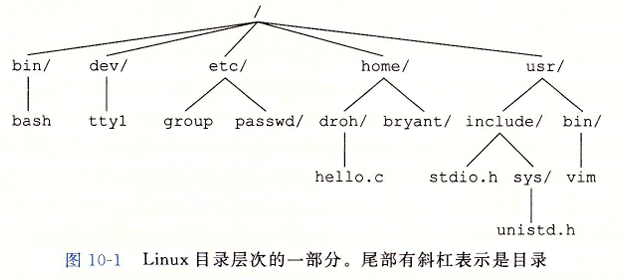
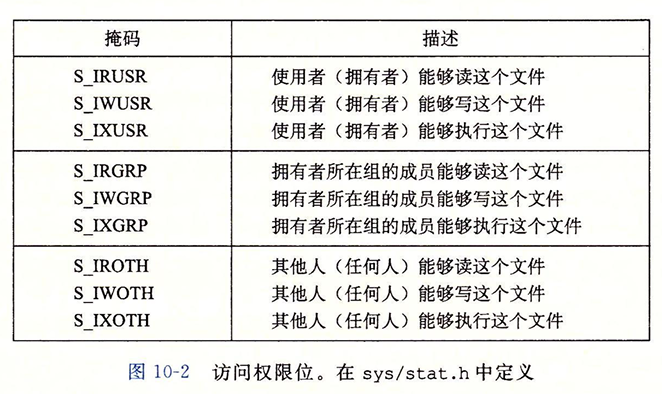
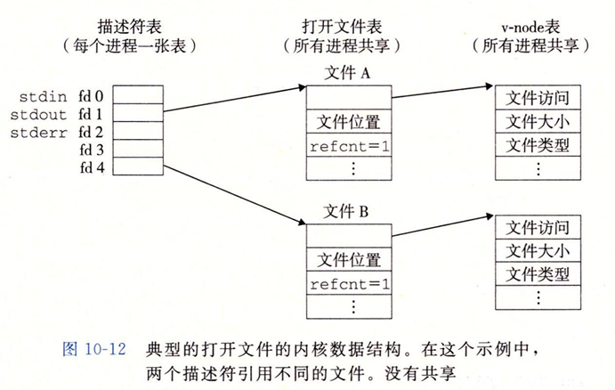
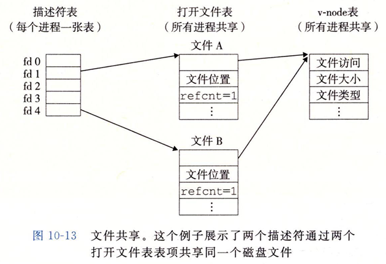
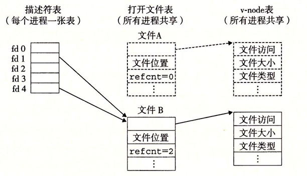

# CSAPP - 系统级I/O

## 文件的基本操作概述

**Linux 系统将所有的 I / O 设备都看成是一个文件**

一个 Linux 文件就是一个 $m$ 个字节的序列 : $B_0, B_1,B_2 \cdots B_{m-1}$ , 那么所有 I/O 操作可以看成是对文件的读写，Linux 内核将外部设备映射到文件上，允许内核向应用提供一个简单的低级接口，比如 `Unix IO`，让用户对所有外部设备的读写都使用一种统一的方式

* **打开文件（opening files）**：

>  当应用程序要求内核访问某个IO设备时，由于对IO设备的抽象，实际上是通过系统调用 `open` ，要求内核打开对应的文件。内核会记录有关该文件的所有信息，并返回一个**描述符（非负数）**给应用程序。在后面的操作中，应用程序通过描述符来识别文件，打开文件的信息由内核追踪。

* **改变当前文件位置（Changing the current file position）**：

> 对于每个打开的文件，内核会维护一个**文件位置（File Position）k** 表示文件当前要读写的位置，初始值 = 0，表示从文件起始位置开始的偏移量。应用程序可以通过 `seek` 操作来修改 k。
>
> > 然而在一些情况下，比如**套接字（socket）**无法通过`seek`修改文件位置

* **读写文件（Reading and writing files）**：

> **读文件**：
>
> 从文件中k开始向后复制n个字节到内存中，并更新 `k = k + n`，如果k超出了文件大小 m，会触发 **end-of-file（EOF）**，会被**应用程序**检测出来并且返回EOF。
>
> **写文件**：
>
> 从内存中复制n个直接到文件 k 中，并更新 `k = k + n`，不会受到EOF限制。

* **关闭文件（Closing files）**：

> 应用程序通过**调用`close`** 或者 **进程终止时** 会通知内核关闭文件，内核会释放文件的数据结构，并且将该文件的描述符恢复成可利用的，在内核为文件找一个描述符时可以被使用到。
>
> > 当进程终止时，会通知内核关闭它当前所有文件，并且释放内存资源


通过将 I/O 设备抽象为文件的形式，在应用程序的角度，只需要通过描述符（而不是文件名）来操作文件，而具体的文件信息由内核进行维护。


## 文件

我们主要介绍一下三种文件类型 : `普通文件` `目录` `socket`

* 普通文件

  可以存储任意数据，由于读入的原因，应用程序需要区分 **二进制文件** 和 **文本文件**，而内核不需要区分，将他们都看成是普通文件。

  > **二进制文件** : 不同文件中除文本文件的所有文件
  >
  > **文本文件** : 全部由 `ASCII` 或 `Unicode` 字符组成的文件，每一行以 `\n` 终止
  >
  > Linux 新一行使用`LF`字符（ASCII 码值 = `0x0a`） 作为开头

* 目录

* socket 套接字 : 用来和其他进程网络通信




### 打开文件

我们通过 `open` 函数来创建或者打开一个文件

```c
#include <sys/types.h>
#include <sys/stat.h>
#include <fcntl.h>

int open(char* filename, int flags, mode_t mode);
```

要是成功则返回文件描述符, 否则返回 $-1$ , 返回的文件描述符是 **当前没有打开的最小描述符数字**

`filename` : 文件名[路径]

`flag` : 表面了访问的方式 :

> $\mathrm{O\_RDONLY}$  只读		$\mathrm{O\_WRONLY}$  只写
>
> $\mathrm{O\_RDWR}$  可读也可写		$\mathrm{O\_CREATE}$  如果文件不存在, 则创建一个空文件
>
> $\mathrm{O\_TRUNC}$  如果文件存在, 就清空它 	$\mathrm{O\_APPEND}$ 在每次写操作前, 设置文件位置到文件末尾

可以通过位运算来将这些 flag 组合

`mode` : 表示了访问权限 : 



​	作为上下文的一部分，每个进程都有一个 `umask` ，它是通过调用 `umask` 函数来设置的。当进程通过带某个 `mode` 参数的 `open` 函数调用来创建一个新文件时，文件的访问权限位被设置为 `mode & ~ umask`

`mask` 函数使用方式如下 : 

```c
mask(S_IWGRP | S_IWOTH);
```


### 关闭文件

```c
#include <unistd.h>

int close(int fd);
```

若成功返回 $0$ , 否则返回 $-1$

关闭一个已经关闭的文件会出错


### 读写文件

我们可以使用 `read` 和 `write` 函数来输入输出

```c
#include <unistd.h>

ssize_t read(int fd, void* buf, size_t n);// 成功返回读的字节数, EOF 返回 0, 出错返回 -1

ssize_t write(int fd, const void* buf, size_t n) // 成功返回写的字节数, 出错返回 -1
```

我们可以通过 `lseek` 函数来修改当前文件的位置

> `ssize_t` 被定义为 `long` , 而 `ssize_t` 被定义为 `int`


## 读取文件元数据

元数据是用来描述数据的数据，由内核维护，可以通过 `stat` 和 `fstat` 函数来访问，

```c
#include <sys/stat.h>
#include <unistd.h>

int stat(const char *filename,struct stat *buf);
int fstat(int fd,struct stat *buf);
// 成功返回 0, 出错返回 -1
```

`stat` 结构是

```c
struct stat
{
    dev_t           st_dev;     // Device
    ino_t           st_ino;     // inode
    mode_t          st_mode;    // Protection & file type
    nlink_t         st_nlink;   // Number of hard links
    uid_t           st_uid;     // User ID of owner
    gid_t           st_gid;     // Group ID of owner
    dev_t           st_rdev;    // Device type (if inode device)
    off_t           st_size;    // Total size, in bytes
    unsigned long   st_blksize; // Blocksize for filesystem I/O
    unsigned long   st_blocks;  // Number of blocks allocated
    time_t          st_atime;   // Time of last access
    time_t          st_mtime;   // Time of last modification
    time_t          st_ctime;   // Time of last change
}
```

我们可以使用一些宏谓语来获取信息

> $\mathrm{S\_ISREG(m)}$	 这是一个普通文件吗 ?
> $\mathrm{S\_ISDIR(m)}$ 	这是一个目录文件吗 ?
> $\mathrm{S\_ISSOCK(m)}$	这是一个网络套接字吗 ?

使用案例如下 : 

```c
int main (int argc, char **argv)
{
    struct stat stat;
    char *type, *readok;
    Stat(argv[1], &stat);
    if (S_ISREG(stat.st_mode)) // 确定文件类型
        type = "regular";
    else if (S_ISDIR(stat.st_mode))
        type = "directory";
    else
        type = "other";
    if ((stat.st_mode & S_IRUSR)) // 检查读权限
        readok = "yes";
    else
        readok = "no";
    printf("type: %s, read: %s\n", type, readok);
    exit(0);
}
```


## 获取目录内容

```c
#include <sys/types.h>
#include <dirent .h>

DIR* opendir(const char *name); // 返回: 若成功，则为处理的指针;若出错，则为 NULL
```

函数 `opendir` 以路径名为参数，返回指向目录流(directory stream)的指针

一般这个函数配合 `readdir` 来使用 :

```c
#include <dirent.h>

struct dirent *readdir(DIR *dirp);
// 返回:若成功，则为指向下一个目录项的指针;若没有更多的目录项或出错，则为 NULL
```

每次对 `readdir` 的调用返回的都是指向流 `dirp` 中下一个目录项的指针，或者，如果没有更多目录项则返回 `NULL`。每个目录项都是一个结构，其形式如下:

```c
struct dirent  {
    ino_t d_ino;	// inode 序号
    char d_name[256]; // 文件名
}
```

> inode 序号可以用来解析文件位置

我们使用 `closedir` 来关闭目录 : 

```c
#include <dirent.h>

int closedir(DIR *dirp);
// 返回:成功为 0; 错误为一1
```


## 文件表和共享文件

在前面提到过打开文件时，内核会维护每个打开的文件，内核会将打开的文件组织成一个表称为**打开文件表（Open file table）**

由于每个进程打开的文件不同，因此还需要有**描述符表（File Table）**表示单个进程打开的文件，同时还会有一个维护所有文件信息的表 **v-node表** 能够供内核知道文件具体的信息



内核有三种数据结构来**表示打开的文件**：

- **描述符表（Descriptor table）**：每个进程有自己独立的描述符表，进程打开的所有文件描述符都包含在表中，**每个文件描述符指向文件表中的一个表项**。
- **文件表（File Table）：**所有进程共享文件表，包含**所有打开文件的文件位置**和**指向的v-node表项**，**引用次数**，由于可能会有不同进程共享一个打开文件表项，所以会有**一个引用次数**表示有多少个描述符指向当前文件表表项，只有当表项的引用次数为0才会删除该表项。
- **v-node 表(i - node)**：所有进程共享v-node表，每个表项包含了`stat`结构中的大多数信息，用来描述文件的信息。在系统中的每个文件无论是否打开，都在v-node表都会有一个对应的表项。

三个表都由内核维护，用户只需要知道文件描述符是哪个，就能够实现对文件的读写等操作。

> 在创建一个进程时，内核会默认打开三个文件，标准输入（描述符为0）、标准输出（描述符为1）和标准错误（描述符为2
>
> 通过`STDIN_FILENO`、`STDOUT_FILENO`和`STDERR_FILENO`代替描述符来访问这三个文件，所以其他文件的描述符不能是这三个。


文件的打开会造成多种情况, 我们一一讲解

* 一个进程打开多个文件

  > 当一个进程打开了不同文件时，每个文件都有一个独立的打开文件表项，也会有一个独立的 v-node 表项。

* 一个进程打开了相同的文件

  > 一个进程对同一文件使用多次 `open` 打开，内核不会将多个 `open` 都认为是相同的，而会认为多个文件的**文件位置**是不同的。内核会为多个文件**分配不同的文件描述符**，使其**指向不同的打开文件表表项**，**获得不同的文件位置**，但是由于基本信息相同，会指向同一个**v-node表项**，这就使得这两个文件描述符可以对同一个文件的不同文件位置进行读写，将不同的**描述符操作**独立开来。
  >
  > 

* 不同的进程 [不是子进程] 打开相同的文件

  >  和单进程是一样的，会映射到不同的文件表项
  >
  > 即 : 会创建多个文件表项但都同时指向一个 `v-node` 表项

* fork 产生的子进程打开相同的文件

  > 由于fork是没有调用open来打开文件，而是直接复制描述符表，因此就会映射到相同的打开文件表项。
  >
  > 在父进程使用`fork`函数创建一个子进程时，子进程会复制父进程的描述符表，由于描述符表中包含指向文件表中的指针，所以子进程中相同的描述符也指向了相同的文件表表项，因此父子进程对**文件位置的修改是共享**的（如上图所示）
  >
  > 我们举个例子 : 
  >
  > ```c
  > #include<sys/types.h>
  > #include<sys/stat.h>
  > #include<fcntl.h>
  > #include<stdio.h>
  > 
  > int main()
  > {
  >     int fd = open("./io.txt", O_RDONLY, 0); // 文件内容 : abcd
  >     char c; int pid;
  >     if((pid = fork()) == 0) {
  >         read(fd, &c, 1);
  >         printf("pid : %d ; c : %c \n", getpid(), c);
  >         _exit(0);
  >     }
  >     if((pid = fork()) == 0) {
  >         read(fd, &c, 1);
  >         printf("pid : %d ; c : %c \n", getpid(), c);
  >         _exit(0);
  >     }
  >     read(fd, &c, 1);
  >     printf("pid : %d ; c : %c \n", getpid(), c);
  >     _exit(0);
  > }
  > /*
  > pid : 5844 ; c : a 
  > pid : 5845 ; c : b 
  > pid : 5846 ; c : c
  > */
  > ```


## IO 重定向

重定向操作符是调用 `dup2` 函数实现的

```c
#include <unistd.h>

int dup2(int oldfd, int newfd); 
// 成功返回非负的描述符, 否则返回 -1
```

如果`newfd`是已打开的文件，`dup2`会首先关闭`newfd`，然后将`oldfd`对应的描述符表项替换`newfd`描述符表项，使得将`newfd`重定向到`oldfd`，如果原始`newfd`对应的文件表表项的引用计数为 0，则会删除对应的文件表表项和v-node表项



示例如下 :

```c
#include<sys/types.h>
#include<sys/stat.h>
#include <unistd.h>
#include<fcntl.h>
#include<stdio.h>

int main()
{
    int fd = open("./io.txt", O_RDWR | O_TRUNC, 0);
    dup2(fd, STDOUT_FILENO);
    printf("dup2 重定向成功\n");
    return 0;
}
// 文件内容从 'abcd' 变化为 'dup2 重定向成功'
```

