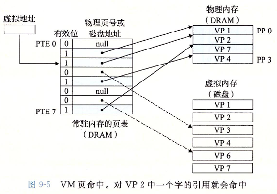
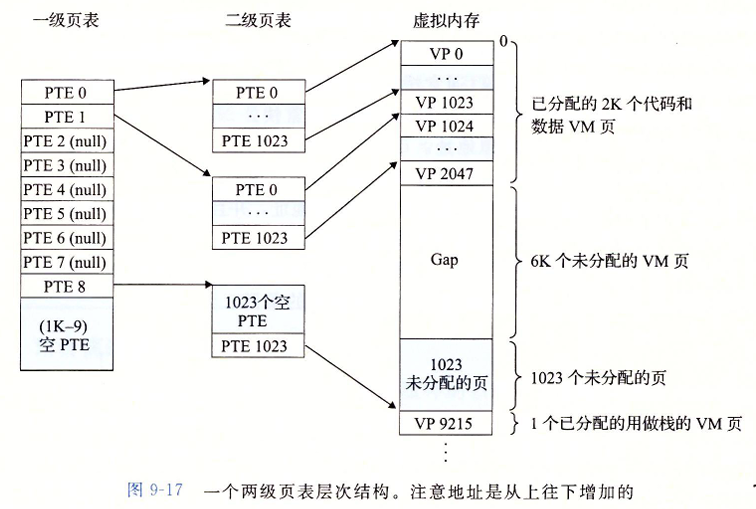

# CSAPP - 虚拟内存

## 前言

​		我们知道计算机会将数据存储在磁盘或者硬盘上, 同时我们使用一个唯一的地址去标识这个位置, 我们也可以通过这个地址来精确的找到我们想要的位置. 我们自然而然的能像到, 如果 CPU 想要知道某一的位置的内容, 那它就可以拿着这个位置的物理地址去寻找, 这种寻址方式就叫**物理寻址**

早期的 PC 会选择物理寻址, 但是现在的处理器会使用一种名叫 **虚拟寻址** 的技术

如上图所示, 

CPU 不会直接用物理地址去寻找, 而是直接使用虚拟地址, 将虚拟地址交给 MMU 单元进行翻译, MMU 将虚拟地址翻译成物理地址再去缓存中寻找, 找到内容后缓存再讲内容直接返回给 CPU

## 地址空间

**地址空间 **(address space) 是一个非负整数地址的有序集合。如果地址空间中整数是连续的，我们说它是 **线性地址空间** (linear address space)。

* 在一个带虚拟内存的系统中，`CPU` 从一个有 $N = 2^n$ 个地址的地址空间中生成虚拟地址，这个地址空间称为虚拟地址空间 (virtual address space)。一个地址空间大小是由表示最大地址所需要的位数来描述的，如 $N = 2^n$ 个地址的虚拟地址空间叫做 $n$ 位地址空间，现在操作系统支持 $32$ 位或 $64$ 位。
* 一个系统还有 **物理地址空间**，它与系统中物理内存的 $M = 2^m$ ( $M$ 不要求是 $2$ 的幂，这里假设为 $2$ 的幂 )个字节相对应。

## 虚拟内存

​		我们先首先简单说明一下虚拟内存为什么会存在, 以及存在的意义,  一个进程在执行的过程中, 进程为认为自己是有一个**连续**的内存空间可以给自己调用的, 该进程的内存的分配和使用都是基于连续来进行的, 但是如果我们电脑上运行的进程多的话, 计算机本身是分配不了那么多连续的内存的, 这就会出现进程无法运行的情况, 但是实际上内存中是有足够的空间来运行这些程序的, 只不过这些地址被分割罢了( 也就是不连续 ), 所以无法直接使用物理地址

​		这个时候就需要虚拟内存出场了, 他可以将这些物理上零散的位置整合成逻辑上的连续 (实际物理位置是不会变化的 ) , 这样, 多余的进程就可以使用这些 "连续" 的内存位置了, 至于如何实现的, 大家可以理解为虚拟内存维护了一张映射表,  将零散的物理地址映射在了一起, 

​		举个例子 : 物理地址有 $5, 13$ , 我维护一张映射表 $1 \Rightarrow 5 , 2 \Rightarrow 13$ , 那么程序看到的就是 $1, 2$ 这两个连续的数字, 但是实际上使用的是 $5, 13$ 这两个不连续的物理位置

​		我们知道在实际的存储过程中, 数据是以一页一页的形式存储的, 我们叫 **物理页** , 为了维护虚拟内存中的映射表, 我们也需要有相对应的形式来表示物理页, 于是我们就定义了 **虚拟页** , 虚拟页是一个抽象的概念, 它和物理页的大小完全相同, 有一种专门的数据结构叫**页表条目**, 它存储着它所对应的物理页在虚拟内存的相关情况

页表条目大致上存储的信息可以分为三大类

* 当前虚拟页还没有分配实际的物理页
* 当前虚拟页分配了具体的物理页, 但是这个物理页没有缓存
* 当前虚拟页分配了具体的物理页, 但是这个物理页缓存了

### 虚拟内存作为缓存的工具

#### 页表

**页表**是一个存放在内存中的**页表条目**(page table entry，`PTE`)的数组，负责将虚拟页映射到物理页

页表条目由**有效位**和 **$n$ 位地址字段**组成：

- 有效位表明该虚拟页是否被缓存在`DRAM`中；
- 如果在，地址字段就表示`DRAM`中相应物理页的起始位置；
- 如果不在，地址字段就指向该虚拟页在磁盘上的起始位置；

#### 页命中, 缺页, 分配页面

- **页命中**：一个页命中的过程，就是一个虚拟地址转换为物理地址的过程。

  

- **缺页**：`DRAM`缓存不命中称为缺页 (page fault)，缺页会触发一个缺页异常，异常调用内核中的缺页异常处理程序，在`DRAM`中选择一个牺牲页。

发生缺页的时候, MMU 会发出一个缺页异常, 之后系统会进入内核态, 然后执行缺页异常处理程序. 缺页异常处理程序会操作缓存, 将请求的页读入缓存中, 之后 CPU会再次向 MMU 请求虚拟地址, 这个时候对应的物理页是已经在缓存中的, 就不会再产生缺页异常了, MMU 将地址给缓存, 缓存读出来之后再返回给 CPU, 这个过程结束

* **分配页面** : 操作系统分配一个新的虚拟内存时，如调用`malloc`，首先在磁盘上面创建空间并更新**页表**的`PTE`，使其中某个`PTE`从原来指向`null`，变成指向磁盘上新创建的页面，此时虚拟页从**未分配**状态变为**未缓存**。

### 虚拟内存作为内存管理的工具

有一点比较重要的是, 每一个进程都有一个属于自己的页表, 它维护者该进程的映射表, 让他能够正常的工作, 因而每一个进程都有一个独立的虚拟地址空间，且每个进程的虚拟地址空间结构都一样

同时, 虚拟内存还简化了链接和加载, 代码和数据共享的过程 : 

* **共享内容** : 如果两个进程使用了共享的内容, 那么他们的页表可以指向同一片区域从而提高效率

  

* **简化链接** : 独立地址空间允许每个进程的内存映像使用相同的基本格式，而不管代码和数据实际存放在物理内存的何处。

  有了虚拟内存的帮助, 每一个进程看自己的内存结构都是一样的 :

  

  每一个进程, 代码段总是从 $\mathrm{0x}400000$ 开始的, 之后再依次递增

* **简化加载** : 更容易向内存中加载可执行文件和共享对象文件

  加载可执行文件和共享文件，要把目标文件中的 `.text` 和 `.data` 节加载到一个新创建的进程中，Linux加载器分配虚拟页的一个连续的片，从虚拟地址 $\mathrm{0x}08048000$ 处开始（ $32$ 位），或者从 $\mathrm{0x}400000$ 处开始（ $64$ 位），加载器为代码段和数据段分配虚拟页，并将其标记为未缓存，将页表条目指向目标文件中适当的位置，加载器不会将任何数据从磁盘复制到内存。

* **简化内存分配** : 当一个运行在用户进程中的程序要求额外的堆内存时(调用 `malloc`)，操作系统会分配 $k$ 个**连续**的虚拟内存页面，并将它们映射到物理内存中**任意**位置的 $k$ 个物理页面。即只需虚拟页面连续，而物理页面随机。

### 虚拟内存作为内存保护的工具

​		任何现代计算机系统必须为操作系统提供手段来控制对内存系统的访问。不应该允许个用户进程修改它的只读代码段。而且也不应该允许它读或修改任何内核中的代码和数据结构。不应该允许它读或者写其他进程的私有内存，并且不允许它修改任何与其他进程共享的虚拟页面，除非所有的共享者都显式地允许它这么做(通过调用明确的进程间通信系统调用)。

​		为了防止内存被非法访问，会在`PTE`上添加一些额外的许可位来控制对一个虚拟页面内容的访问。

- `sup`，进程是否运行在内核模式下才能访问。
- `read`、`write`，读写控制访问。

## 地址翻译

**地址翻译**就是把一个`N`元素虚拟地址空间(VAS)中的元素映射到`M`元素物理地址空间(PAS)中的元素上

简单来说就是将虚拟地址转化为物理地址

* CPU中有一个页表基地址寄存器(Page Table Base Register, PTBR)指向当前页表，用于快速定位。
* $n$ 位的虚拟地址划分为 $p$ 位的虚拟地址偏移 `VPO` 和( $n - p$ )位的虚拟页号VPN。
* $m$ 位物理地址划分为 $p$ 位的物理地址偏移 `PPO` 和( $m - p$ )位的物理页号PPN。

因为虚拟页和物理页大小都是 $P$ 字节，所以 `VPO`和 `PPO` 是相同的。`MMU` 利用 `VPN` 来选择 `PTE` ，进而得到 `PPN` ，由于 `VPO` 与 `PPO`相同，因此将 `PPN` 与 `VPO` 串联起来就得到了物理地址。

为了能够更加直观的演示地址翻译的全过程, 我们举下面的例子 : 

我们约定入下 : 

* 虚拟地址是 $14$ 位长的 $n = 14$ , 物理地址是 $12$ 位长的 $m = 12$
* 页面大小是 $64$ 个字节的 $P = 64$

* 我们要翻译的虚拟地址是 $\mathrm{0x0E1A}$ 

----

具体的步骤如下 : 

### 页命中情况

1. 确定 `VPN` `PPN` `VPO` `PPO` 的位数

   > 因为一个虚拟页(物理页) 的大小是 $64$ 个字节, 转化为二进制为 $2^8$ , 所以虚拟页偏移量(VPO) 和 物理页偏移量 (PPO) 是有 $8$ 位的, 有因为虚拟地址总共 $14$ 位, 所以虚拟页号一共有 $6$ 位, 凑成 $2$ 的进制倍为 $8$ 位
   >
   > 同理, 物理页号一共有 $4$ 位

2. 提取出 `VPN` 和 `VPO` 

   > 根据我们算出的位数提取出来即可, 提取结果如下 :
   >
   > $\mathrm{VPN = 0E} \qquad \mathrm{VPO = PPO = 1A}$

3. 根据 CPU 中的页表基址寄存器查看页表信息, 并找到对应的 `VPN`

   > 
   >
   > 发现 $\mathrm{0E}$ 对应的 `PPN` 为 $\mathrm{11}$ , 同时有效位为 $1$ , 说明该虚拟页已分配并且已缓存
   >
   > 我们将两个部分组装在一起, 得到物理地址 $\mathrm{0x111A}$

这是最简单并且最顺利的情况, 但是我们也要考虑缺页的处理情况

### 缺页情况

如果这个时候我们需要翻译的虚拟地址是 $\mathrm{0x0504}$

​		那么当我们进行到第三步的时候, 会发现页表对应的有效位不为 $1$ , 但是内容也不是 $null$ , 说明这个虚拟页是已分配但是没有在缓存中的, 这个虚拟页所对应的虚拟地址是 $\mathrm{0x1604}$ , 于是 `MMU` 就会触发一个缺页异常, 系统进入内核态然后调用缺页异常处理程序 , 缺页异常处理程序进入缓存, 进行组选择, 行匹配, 将对应的物理页内容放到缓存中后, 修改页表中的有效位为 $1$

​		之后 CPU 再次向 `MMU` 发送对于虚拟地址 $\mathrm{0x0504}$ 的翻译请求, 这次页命中返回

### 使用 TLB 加速地址翻译

我们发现, 如果进行大量的地址翻译的话, 每次都需要从 CPU中的页表基址寄存器中取出起始地址, 然后再到内存中读取对应的内容, 这会十分的浪费时间, 如果需要的表项在 L1 cache 中还好, 如果不命中向下级请求的话开销非常大, 于是考虑用一个专门的缓存来缓存表项, 这个缓存就叫 TLB, 也叫快表

TLB 也分命中和不命中, 具体的细节和我们之前讲的 存储器体系结构相似, 也就不做赘述了

### 多级页表

我们一开始讲过, 在内存中开辟一段连续的地址空间十分的困难, 但是值得注意的是, 我们的页表就需要一段连续的地址空间来存储信息, 如果我们的地址空间过多的话, 那么存储页表本身就是一件不可能的事情

所以我们采用分级的方式去存储页表, 我们将一个虚拟地址组织成下面的形式

同时一级页表也不再存储物理页的信息, 而是存储二级页表的地址

于是整体的结构为 :

