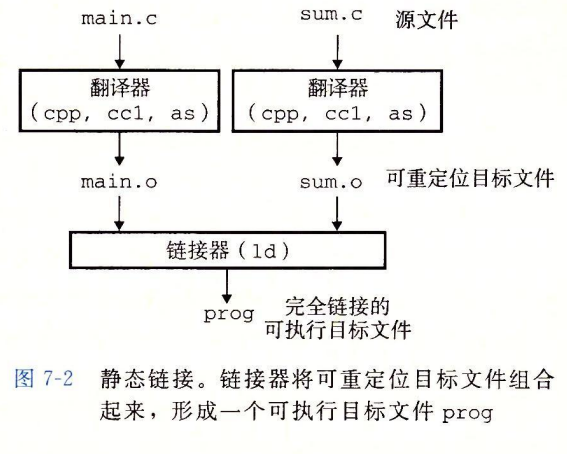
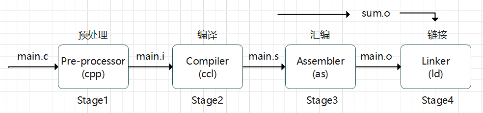
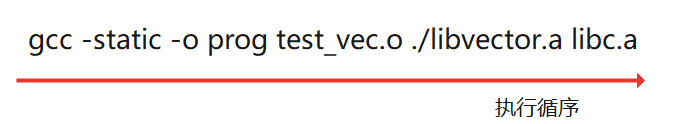
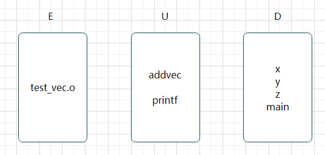
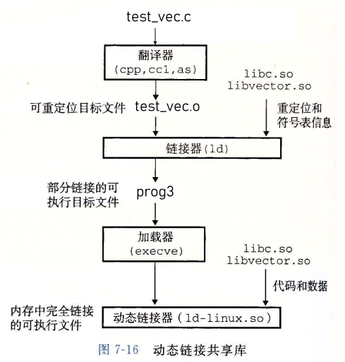

# CSAPP-链接

## 链接概述

**链接（linking）**是将各种代码和数据片段 **收集并组合成为一个单一文件** 的过程，这个文件可被加载（复制）到内存并执行

用直白的话来说，可以理解为多文件编程，把一个系统中的功能在不同的文件中编写，之后再将这些文件构造成一个可执行文件

分解为多个文件实现也有利于管理和更新迭代

链接可执行的阶段

- 可执行于 **编译时**：在源代码被翻译成机器代码时，
- 可执行于 **加载时**：在程序被加载器加载到内存并执行时
- 可执行于 **运行时**：应用程序来执行。

在早期的计算机系统中，链接是手动执行。在现代系统中，链接是由链接器的程序自动执行。

链接器使得 **分离编译** 成为可能，将一个大型的应用程序，通过分拆模块，独立进行修改和编译。


## 链接使用实例

我们来看两个 C语言代码：

```c
// main.c
int sum(int* a, int n);
int array[2] = {1,2};
int main()
{
    int val = sum(array, 2);
    return val;
}
```

```c
// sum.c
int sum(int* a, int n) {
    int s = 0;
    for(int i = 0 ; i < n ; i ++)
        s += a[i];
    return s;
}
```

我们可以直接将上述两个文件合并编译为一个可执行文件：

调用 GCC 命令 `gcc -Og -o prog main.c sum.c`

> `-Og` 表示代码优化等级，这个等级代表生成的汇编尽可能保持原来的 C 风格
>
> `-o` 表示 `output file` 代码指定可执行文件的名字为 `prog`

编译器在执行上述过程的具体流程如下图所示



我们再将整个过程细化一下：



> **Stage1**
>
> 我们可以使用以下两个中的任意一个命令将 `main.c` 编译为 `main.i`
>
> ```
> cpp -o main.i main.c
> ```
>
> ```
> gcc -E -o main.i main.c
> ```
>
> `cpp` 代表 `c preprocessor ` 即 C预处理器
>
> `main.i` 实际上是 `main.c` 的 $ASCII$ 码的中间文件
>
> ```ini
> //main.i
> # 1 "main.c"
> # 1 "<built-in>"
> # 1 "<command-line>"
> # 1 "main.c"
> int sum(int* a, int n);
> int array[2] = {1,2};
> int main()
> {
>     int val = sum(array, 2);
>     return val;
> }
> ```

> **Stage2**
>
> 编译阶段，将 `main.i` 翻译为汇编文件 `main.s`
>
> 使用如下两个命令的任意一个即可
>
> ```
> cc -S -o main.s main.i
> ```
>
> ```
> gcc -S -o main.s main.i
> ```
>
> `cc` 代表 `c compiler`， 即 ： C 编译器
>
> ```assembly
> 	.file	"main.c"
> 	.text
> 	.globl	array
> 	.data
> 	.align 8
> array:
> 	.long	1
> 	.long	2
> 	.def	__main;	.scl	2;	.type	32;	.endef
> 	.text
> 	.globl	main
> 	.def	main;	.scl	2;	.type	32;	.endef
> 	.seh_proc	main
> main:
> 	pushq	%rbp
> 	.seh_pushreg	%rbp
> 	movq	%rsp, %rbp
> 	.seh_setframe	%rbp, 0
> 	subq	$48, %rsp
> 	.seh_stackalloc	48
> 	.seh_endprologue
> 	call	__main
> 	movl	$2, %edx
> 	leaq	array(%rip), %rcx
> 	call	sum
> 	movl	%eax, -4(%rbp)
> 	movl	-4(%rbp), %eax
> 	addq	$48, %rsp
> 	popq	%rbp
> 	ret
> 	.seh_endproc
> 	.ident	"GCC: (x86_64-posix-seh-rev0, Built by MinGW-W64 project) 8.1.0"
> 	.def	sum;	.scl	2;	.type	32;	.endef
> ```

> **Stage3**
>
> 使用汇编器 `as` 将 `main.s` 翻译为一个**可重定向目标文件** `main.o`
>
> 可重定向目标文件我们之后会重点解释
>
> 我们可以使用以下这个命令
>
> ```
> as -o main.o main.s
> ```
>
> 这个文件无法直接查看

> **stage4**
>
> 我们以同样的过程获得 `sum.o` 文件后，就可以尝试手动用l链接器打包了
>
> 不过我们还需要用到其他可重定向文件，
>
> 我们可以执行以下命令
>
> ```
> ld -static -o prog main.o sum.o
> /usr/lib/x86_64-linux-gnu/crt1.o
> /usr/lib/x86_64-linux-gnu/crti.o
> -L/usr/lib/gcc/x86_64-linux-gnu/7/crtbeginT.o
> -L/usr/lib/gcc/x86_64-linux-gnu/7 -L/usr/lib
> -L/usr/lib
> --static-group -lgcc -lgcc_eh -lc --end-group
> -L/usr/lib/gcc/x86_64-linux-gnu/7/crtend.o
> /usr/lib/x86_64-linux-gnu/crtn.o
> ```
>
> 每个人的路径不一样，大家具体情况具体执行
>
> 对于这些文件有兴趣的同学可以看《程序员的自我修养》一书


## 可重定向文件

所谓的可重定向文件，就是我们之前得到的 `main.o` 文件，为了大家能够更加好的理解可重定向文件

我们重新构建了两个 C 语言代码：

```c
// main.c
int main()
{
    static int a = 1;
    static int b = 0;
    int x = 1;
    func(a + b + x);
    return 0;
}
```

```c
// fun.c
#include<stdio.h>
int count = 10;
int value;
void func(int sum) {
    printf("sum is %d\n", sum);
}
```

我们单独编译这两个文件得到 `main.o` 和 `fun.o` 文件

使用命令 : `gcc -c main.c` 和 `gcc -c fun.c`

我们使用 `wc main.o` 来统计 `main.o` 的大小，结果为 ` 2   15 1512 main.o`  即有 1512 格字节

我们把可重定向文件分为三个部分


ELF 是 可执行可链接格式的缩写(Executable and Linkable Format)

### 查看 ELF header

我们先来看看 ELF header 里面有什么，我们可以使用下面的命令

```
[Linux]> readelf -h main.o
ELF 头：
  Magic：  7f 45 4c 46 02 01 01 00 00 00 00 00 00 00 00 00 
  类别:                              ELF64
  数据:                              2 补码，小端序 (little endian)
  版本:                              1 (current)
  OS/ABI:                            UNIX - System V
  ABI 版本:                          0
  类型:                              REL (可重定位文件)
  系统架构:                          Advanced Micro Devices X86-64
  版本:                              0x1
  入口点地址：              0x0
  程序头起点：              0 (bytes into file)
  Start of section headers:          744 (bytes into file)
  标志：             0x0
  本头的大小：       64 (字节)
  程序头大小：       0 (字节)
  Number of program headers:         0
  节头大小：         64 (字节)
  节头数量：         12
  字符串表索引节头： 11
```

我们首先来讲解一下 `Magic` 中每个数字的含义

1. 前四个字符 ： `7f 45 4c 46`

   > 这四个字符用来指定文件的类型，也就是魔数
   >
   > 操作系统在加载可执行文件的时候，会验证魔数，如果不正确会拒绝加载
   >
   > 这四个字符对应的含义分别为 ： 
   >
   > `7f : 'DEL'` 	`45 : 'E'` 	`4c : 'L'`	`46 : F`

2. 第五个字符 ： `02`

   > 用来表示ELF的文件类型
   >
   > `01 : 32 位`		`02 : 64位`

3. 第六个字符 : `01`

   > 表示字节序
   >
   > `01 : 小端法`		`02 : 大端法`

4. 第七个字符 ： `01`

   > ELF 的版本号，一般是 `01`

5. 剩下的所有字符用 `00` 填充，没有实际意义


我们接着看看一些有用的信息：

1. `类型: REL (可重定位文件)` 这说明我们的文件是一个可重定向文件

   > 除此之外还有可执行文件和共享文件两种类型

2. `  节头大小： 64 (字节)` 和 ` 入口点地址： 0x0`

   > 我们可以算出 : `section` 在 `elf` 文件中的起始地址位 `0x40`

3. `Start of section headers: 744 (bytes into file)`

   > 代表 `section headers table` 的起始地址为 744

4.  `节头数量：12` `节头大小：64 (字节)`

   > `section header table` 中 一共有 12 个表项， 每个大小为 64 字节
   >
   > 我们简单验证一下：
   >
   > $12 \times 64 + 744 = 1512$ ， 刚好和我们之前 `wc` 命令中得到的一样


### 查看 Sections

我们接下来看看 `Sections` 中的内容：

```
[Linux]> readelf -S main.o
共有 12 个节头，从偏移量 0x2e8 开始：

节头：
  [号] 名称               类型              地址              偏移量
       大小              全体大小          旗标   链接   信息   对齐
  [ 0]                   NULL             0000000000000000  00000000
       0000000000000000  0000000000000000           0     0     0
  [ 1] .text             PROGBITS         0000000000000000  00000040
       0000000000000035  0000000000000000  AX       0     0     1
  [ 2] .rela.text        RELA             0000000000000000  00000228
       0000000000000048  0000000000000018   I       9     1     8
  [ 3] .data             PROGBITS         0000000000000000  00000078
       0000000000000004  0000000000000000  WA       0     0     4
  [ 4] .bss              NOBITS           0000000000000000  0000007c
       0000000000000004  0000000000000000  WA       0     0     4
  [ 5] .comment          PROGBITS         0000000000000000  0000007c
       000000000000002e  0000000000000001  MS       0     0     1
  [ 6] .note.GNU-stack   PROGBITS         0000000000000000  000000aa
       0000000000000000  0000000000000000           0     0     1
  [ 7] .eh_frame         PROGBITS         0000000000000000  000000b0
       0000000000000038  0000000000000000   A       0     0     8
  [ 8] .rela.eh_frame    RELA             0000000000000000  00000270
       0000000000000018  0000000000000018   I       9     7     8
  [ 9] .symtab           SYMTAB           0000000000000000  000000e8
       0000000000000120  0000000000000018          10    10     8
  [10] .strtab           STRTAB           0000000000000000  00000208
       0000000000000020  0000000000000000           0     0     1
  [11] .shstrtab         STRTAB           0000000000000000  00000288
       0000000000000059  0000000000000000           0     0     1
Key to Flags:
  W (write), A (alloc), X (execute), M (merge), S (strings), I (info),
  L (link order), O (extra OS processing required), G (group), T (TLS),
  C (compressed), x (unknown), o (OS specific), E (exclude),
  l (large), p (processor specific)
```


我们重点介绍下面的几个 Section：

#### text section

`.text` 这个 section 主要是存放已经编译好的机器代码

> 我们可以使用 `objdump` 来查看信息
>
> ```
> [Linux] > objdump -d  main.o
> main.o：     文件格式 elf64-x86-64
> Disassembly of section .text:
> 0000000000000000 <main>:
>    0:   55                      push   %rbp
>    1:   48 89 e5                mov    %rsp,%rbp
>    4:   48 83 ec 10             sub    $0x10,%rsp
>    8:   c7 45 fc 01 00 00 00    movl   $0x1,-0x4(%rbp)
>    f:   8b 15 00 00 00 00       mov    0x0(%rip),%edx        # 15 <main+0x15>
>   15:   8b 05 00 00 00 00       mov    0x0(%rip),%eax        # 1b <main+0x1b>
>   1b:   01 c2                   add    %eax,%edx
>   1d:   8b 45 fc                mov    -0x4(%rbp),%eax
>   20:   01 d0                   add    %edx,%eax
>   22:   89 c7                   mov    %eax,%edi
>   24:   b8 00 00 00 00          mov    $0x0,%eax
>   29:   e8 00 00 00 00          callq  2e <main+0x2e>
>   2e:   b8 00 00 00 00          mov    $0x0,%eax
>   33:   c9                      leaveq 
>   34:   c3                      retq 
> ```


#### data section

`.data` ： 这个Section 主要是存放已经初始化的全局变量或者静态变量的值

> 我们可以使用下面的命令查看所有的 Section：
>
> ```
> [Linux] > objdump -s  fun.o
> fun.o：     文件格式 elf64-x86-64
> 
> Contents of section .text:
>  0000 554889e5 4883ec10 897dfc8b 45fc89c6  UH..H....}..E...
>  0010 bf000000 00b80000 0000e800 000000c9  ................
>  0020 c3                                   .               
> Contents of section .data:
>  0000 0a000000                             ....            
> Contents of section .rodata:
>  0000 73756d20 69732025 640a00             sum is %d..     
> Contents of section .comment:
>  0000 00474343 3a202847 4e552920 342e382e  .GCC: (GNU) 4.8.
>  0010 35203230 31353036 32332028 52656420  5 20150623 (Red 
>  0020 48617420 342e382e 352d3434 2900      Hat 4.8.5-44).  
> Contents of section .eh_frame:
>  0000 14000000 00000000 017a5200 01781001  .........zR..x..
>  0010 1b0c0708 90010000 1c000000 1c000000  ................
>  0020 00000000 21000000 00410e10 8602430d  ....!....A....C.
>  0030 065c0c07 08000000                    .\......        
> ```
>
> 我们发现中间有一部分内容如下：
>
> ```
> Contents of section .data:
>  0000 0a000000                             .... 
> ```
>
> `fun.c` 中全局定义了一个变量 `int count = 10` , 
>
> 我们单独把这个字节拿出来 `0a000000` 我们知道表示方法是小端法，所以数值为 `0x0a` 
>
> 转化为十进制刚好为 `10`


#### bss section

`.bss` 存放未初始化的全局变量和静态变量

> 值得注意的是被初始化为 0 的全局变量和静态变量也存放在这里
>
> 但是奇怪的是，我们查略之前的表发现 
>
> ```
>   [ 3] .data             PROGBITS         0000000000000000  00000078
>        0000000000000004  0000000000000000  WA       0     0     4
>   [ 4] .bss              NOBITS           0000000000000000  0000007c
>        0000000000000004  0000000000000000  WA       0     0     4
>   [ 5] .comment          PROGBITS         0000000000000000  0000007c
>        000000000000002e  0000000000000001  MS       0     0     1
> ```
>
> 1. `.bss` 和 `.comment` 的起始地址是一样的 `0000007c`
> 2. 无论如何变化，`.bss` 的大小都是 4 个字节
>
> 实际上， `bss section` 并不占据实际的空间，它仅仅是一个占位符，区分初始化和未初始化的变量
>
> 计算机的逻辑是:
>
> 如果是静态变量，在 `.data` 中找不到，并且 `.bss` 存在，就默认为未初始化活初始化为 $0$


#### rodata section

`.rodata` 存放只读的数据

> 例如： `printf` 的格式字符串以及 `switch` 跳转表就是存放在这个部分
>
> 我们拿出之前 objdump 中的到的部分发现
>
> ```
> Contents of section .rodata:
>  0000 73756d20 69732025 640a00             sum is %d..   
> ```
>
> 我们的格式字符串确实存放在这里


#### symtab section

这个 section 是存放符号表

我们可以使用下面的命令来显示符号表

```
[Linux] > readelf -s main.o
Symbol table '.symtab' contains 12 entries:
   Num:    Value          Size Type    Bind   Vis      Ndx Name
     0: 0000000000000000     0 NOTYPE  LOCAL  DEFAULT  UND 
     1: 0000000000000000     0 FILE    LOCAL  DEFAULT  ABS main.c
     2: 0000000000000000     0 SECTION LOCAL  DEFAULT    1 
     3: 0000000000000000     0 SECTION LOCAL  DEFAULT    3 
     4: 0000000000000000     0 SECTION LOCAL  DEFAULT    4 
     5: 0000000000000000     4 OBJECT  LOCAL  DEFAULT    3 a.1723
     6: 0000000000000000     4 OBJECT  LOCAL  DEFAULT    4 b.1724
     7: 0000000000000000     0 SECTION LOCAL  DEFAULT    6 
     8: 0000000000000000     0 SECTION LOCAL  DEFAULT    7 
     9: 0000000000000000     0 SECTION LOCAL  DEFAULT    5 
    10: 0000000000000000    53 FUNC    GLOBAL DEFAULT    1 main
    11: 0000000000000000     0 NOTYPE  GLOBAL DEFAULT  UND func
[Linux] > readelf -s fun.o
Symbol table '.symtab' contains 13 entries:
   Num:    Value          Size Type    Bind   Vis      Ndx Name
     0: 0000000000000000     0 NOTYPE  LOCAL  DEFAULT  UND 
     1: 0000000000000000     0 FILE    LOCAL  DEFAULT  ABS fun.c
     2: 0000000000000000     0 SECTION LOCAL  DEFAULT    1 
     3: 0000000000000000     0 SECTION LOCAL  DEFAULT    3 
     4: 0000000000000000     0 SECTION LOCAL  DEFAULT    4 
     5: 0000000000000000     0 SECTION LOCAL  DEFAULT    5 
     6: 0000000000000000     0 SECTION LOCAL  DEFAULT    7 
     7: 0000000000000000     0 SECTION LOCAL  DEFAULT    8 
     8: 0000000000000000     0 SECTION LOCAL  DEFAULT    6 
     9: 0000000000000000     4 OBJECT  GLOBAL DEFAULT    3 count
    10: 0000000000000004     4 OBJECT  GLOBAL DEFAULT  COM value
    11: 0000000000000000    33 FUNC    GLOBAL DEFAULT    1 func
    12: 0000000000000000     0 NOTYPE  GLOBAL DEFAULT  UND printf
```

简单介绍一下各个标题的意思

1. `Num` : 编号

2. `Value` ： 这个符号的开头相对于 `.text` 的偏移量

3. `Size` ： 这个符号的大小

4. `Type` ： 类型

   > `FUNC` : 表示函数 	`OBJECT` ： 表示对象，数组和基本变量属于对象
   >
   > `SECTION` ： 实际上是 section名字本身	

5. `Bind` : 是全局可见还是局部可见

6. `Ndx` ： 在哪一个section， 对应的是那张section表

   > `UND` 表示未定义，可能来自其他文件
   >
   > `COM` 和 `bss` 很像
   >
   > `COMMENT` 存放未初始化的全局变量
   >
   > `BSS` 存放未初始化的全局变量和静态变量，或初始化为 0 的全局静态变量

7. `name` : 命名

   > 只有是局部的静态变量才会出现，其他一般局部变量不关心
   >
   > 为了防止重名，所以会加上后缀


## 符号解析

### 符号未定义情况

我们假设我们现在有这样一个源文件

```c
// linkerror.c
void foo(void);
int main()
{
        foo();
        return 0;
}
```

我们只对这个文件进行编译和汇编,那么这个文件实际上是不会有问题的

编译器会默认吧 `foo()` 函数当做在其他文件声明定义

```
[Linux] > gcc -c linkerror.c
```

执行上面的命令生产 `linkerror.o` , 但是我们其实进行链接的操作就会报错:

```
[Linux] > gcc -Wall -Og -o linkerror linkerror.c
/tmp/ccS4v5Qw.o：在函数‘main’中：
linkerror.c:(.text+0x5)：对‘foo’未定义的引用
collect2: 错误：ld 返回 1
```

可以发现由于未定义, 并不能编译为可执行文件,我们简单查看一下符号表

```
[Linux] >  readelf -s linkerror.o
Symbol table '.symtab' contains 10 entries:
   Num:    Value          Size Type    Bind   Vis      Ndx Name
     0: 0000000000000000     0 NOTYPE  LOCAL  DEFAULT  UND 
     1: 0000000000000000     0 FILE    LOCAL  DEFAULT  ABS linkerror.c
     2: 0000000000000000     0 SECTION LOCAL  DEFAULT    1 
     3: 0000000000000000     0 SECTION LOCAL  DEFAULT    3 
     4: 0000000000000000     0 SECTION LOCAL  DEFAULT    4 
     5: 0000000000000000     0 SECTION LOCAL  DEFAULT    6 
     6: 0000000000000000     0 SECTION LOCAL  DEFAULT    7 
     7: 0000000000000000     0 SECTION LOCAL  DEFAULT    5 
     8: 0000000000000000    16 FUNC    GLOBAL DEFAULT    1 main
     9: 0000000000000000     0 NOTYPE  GLOBAL DEFAULT  UND foo
```

发现链接器实际上是为它生成了相应的符号, 但是类型是 `UND` 类型, 所以最后会报错


### 符号重复定义情况

#### 强符号和弱符号

我们将变量初始时的情况进行分类

* **强符号 ( Strong Symbols ) :**

  函数和已经初始化的全局变量

* **弱符号 ( Weak Symbols ) :**

  未初始化的全局变量

#### 多个同名强符号

最简单的情况就是 :

```c
// fool.c
int x = 12345;
int main()
{
	return 0;
}
// bar1.c
int x = 56789;
int main()
{
    return 0;
}
```

可以发现, 两个名为 `main` 的同名强符号同时出现, 这个时候链接器就会报错

同时发现还有一个同名的全局变量 `x` , 这个也是强符号, 所以也是错误的


#### 一个强符号和多个同名弱符号

假设我们有以下两个源文件

```c
// foo3.c
#include<stdio.h>
void f(void);
int x = 12345;
int main()
{
    f();
    printf("x = %d\n", x);
    return 0;
}
// bar.c
int x;
void f() {
    x = 56789;
}
```

我们把它编译为可执行文件 `linkerror2` , 执行发现最后的结果和我们想象的并不一样

```
[Linux] > ./linkerror2
x = 56789
```

因为在 `bar.c` 中, `x` 并没有被初始化值, 所以属于弱符号, 所以链接器会将同名的强符号作为最终的符号

贯穿所有需要链接的文件之中, 在所有文件中共享

所以 `bar3.c` 中可以修改 `foo3.c` 中的值, 这对于`foo3.c` 的作者来说实际上是匪夷所思的


#### 多个同名弱符号

我们先考虑定义的符号是**同类型的**:

```c
// foo4.c
#include<stdio.h>
void f(void);
int x;
int main()
{
    x = 12345;
    f();
    printf("x = %d\n", x);
    return 0;
}
// bar4.c
int x;
void f() {
    x = 56789;
}
```

我们编译生成 `linkerror3` , 执行后发现结果和之前一样

```
[Linux] > ./linkerror3
x = 56789
```

但是我们仅仅调换一下 `x = 12345;` 和 `f()` 的顺序, 我们就可以得到 `x = 12345`

综合, 我们得出, 链接器会将这些弱符号一视同仁, 谁先赋值就将这个值赋到该变量上

换句话说, 将这些同名的弱符号看成一个弱符号, 因为他们都是等价的


#### 同名符号类型不同

我们现在有这样两个源文件

```c
// foo5.c
#include<stdio.h>
void f(void);
int y = 15212;
int x = 15213;
int main()
{
    printf("origin : x = 0x%x y = 0x%x\n", x, y);
    f();
    printf("final : x = 0x%x y = 0x%x\n", x, y);
    return 0;
}
// bar5.c
double x;
void f() {
    x = -0.0;
}
```

我们编译生成 `linkerror4` , 执行后发现结果非常奇怪

```
[Linux] > ./linkerror4
origin : x = 0x3b6d y = 0x3b6c
final : x = 0x0 y = 0x80000000
```

我们发现 `y` 的值也一并修改了

因为初始为全局变量, `x` , `y` 的地址是相邻的

`double` 所占的大小是八个字节, 而 `int` 是占四个字节, 所以将 `x` 看成 `double` 后会同时修改 `y` 的值

实际上在编译的时候就会有警告, 但是链接器还是会顺利链接

```
[Linux] > gcc -Og -o linkerror4 foo5.c bar5.c
/usr/bin/ld: Warning: alignment 4 of symbol `x' in /tmp/ccuM7JEZ.o is smaller than 8 in /tmp/cc0VOCEP.o
```


## 静态库

静态库实际上是一系列可重定向文件的集合, 在linux 中, 静态库是以 `.a` 文件结尾的

我们常用的 `printf` 函数就是合并在了 `libc.a` 文件中

我们可以查看相关的信息, 我们截取了部分输出

```
[Linux] > objdump -t .../libc.a >> info.txt
[Linux] > grep -n printf.o info.txt
...
6870:printf.o：     文件格式 elf32-x86-64
...
```

我们同时也可以解压这个静态库文件

```
[Linux] > ar -x .../libc.a
```


### 构造静态库

我们假设我们有两个文件, 如下:

```c
// addvec.c
int addcnt = 0;
void addvec(int* x, int* y, int* z, int n) {
     int i = 0; addcnt ++;
     for(; i < n ; i ++ )
	z[i] = x[i] + y[i];
}
```

```c
// mulvec.c
int mulcnt = 0;
void mulvec(int* x, int* y, int* z, int n) {
     int i = 0; mulcnt ++;
     for(; i < n ; i ++ )
	z[i] = x[i] * y[i];
}
```

```c
// test_vec.c
#include<stdio.h>
void addvec(int* x, int* y, int*z, int n);
int x[2] = {1, 2}, y[2] = {3, 4};
int z[2];
int main()
{
     addvec(x, y, z, 2);
     printf("z = [%d %d]\n", z[0], z[1]);
     return 0;
}
```

我们先构造静态库文件,  在 Linux 中,静态库文件的后缀为 `.a` , 构造静态库文件的方法也很简单,

运行如下的命令

```
// 先编译成可重定向文件
[Linux] > gcc -c mulvec.c addvec.c
// 构造成静态库
[Linux] > ar rcs libvector.a addvec.o mulvec.o
```

接下来编译链接即可

```
// 编译为可重定向文件
[Linux] > gcc -c test_vec.c
// 静态库链接
[Linux] > gcc -static -o prog test_vec.o ./libvector.a
```

> 如果你报了一下错误, 是因为你的系统缺少了静态 C 库
>
> ```
> /usr/bin/ld: 找不到 -lc
> collect2: 错误：ld 返回 1
> ```
>
> 如果你是 CentOs 系统, 可以使用以下命令安装 :
>
> ```
> sudo yum install glibc-static
> ```


### 静态库解析过程

在符号解析阶段, 链接器从左到右扫描可重定向文件和静态库文件



> 链接器会隐式的传递 `libc.a` , 所以不用每次都把 `libc.a` 写上

在扫描的过程中, 链接器会维护三个集合


> E : 扫描过程中的重定向文件的集合
>
> U : 引用了但是尚未应用的符号的集合
>
> D : 已定义符号的集合

最开始扫描到 `test_vec.o`  , 发现是一个重定向文件, 放到 `E` 中

查看 `test_vec.o` 的符号表, 发现一些 `UDE` 和 定义符号

```
// 截取部分
 9: 0000000000000000     8 OBJECT  GLOBAL DEFAULT    3 x
10: 0000000000000008     8 OBJECT  GLOBAL DEFAULT    3 y
11: 0000000000000004     8 OBJECT  GLOBAL DEFAULT  COM z
12: 0000000000000000    65 FUNC    GLOBAL DEFAULT    1 main
13: 0000000000000000     0 NOTYPE  GLOBAL DEFAULT  UND addvec
14: 0000000000000000     0 NOTYPE  GLOBAL DEFAULT  UND printf
```

所以集合变为 :



之后再扫描 `libvectoer.a` , 链接器会依次扫描静态库中的所有可执行文件, 发现可以填补 `U` 集合中的符合, 就会将这个可重定向文件移动到 `E` 集合, 同时删去 `U` 集合中对应的符号, 添加对应的  `D` 符号

等所有的文件扫描完成后, 如果 `U` 集合不为空, 就会报错


**值得注意的是 : 如果静态库中存在相互调用的情况,  命令的顺序是有讲究的**


## 重定位

重定位的操作主要有两步: 合并输入模块, 并为每个符号分配运行时内存

* 重定位节和符号定义
* 重定位节中的符号引用


我们拿以下的代码展示 :

```c
// main.c
int sum(int* a, int n);
int array[2] = {1,2};
int main()
{
    int val = sum(array, 2);
    return val;
}
```

```c
// sum.c
int sum(int* a, int n) {
    int s = 0;
    for(int i = 0 ; i < n ; i ++)
        s += a[i];
    return s;
}
```

连接器会首先将所有重名的节直接合并, 这个时候, 每一个符号都有了自己唯一的运行时内存

但是我们发现原生的 `main.o` 中的调用实际上是不知道 `sum` 函数的地址的

```assembly
0000000000000000 <main>:
   0:   55                      push   %rbp
   1:   48 89 e5                mov    %rsp,%rbp
   4:   48 83 ec 10             sub    $0x10,%rsp
   8:   be 02 00 00 00          mov    $0x2,%esi
   d:   bf 00 00 00 00          mov    $0x0,%edi
  12:   e8 00 00 00 00          callq  17 <main+0x17>
  17:   89 45 fc                mov    %eax,-0x4(%rbp)
  1a:   8b 45 fc                mov    -0x4(%rbp),%eax
  1d:   c9                      leaveq 
  1e:   c3                      retq
```

在编译的过程中, 调用过程会使用 $0$ 来代替, 如 :  `e8 00 00 00 00`

所以链接器需要知道 `sum` 的实际地址

​	这一步需要依赖可重定位条目, 这个东东是汇编器遇到不知道实际地址的调用时自动生成的, 用来告诉链接器如何确定这个引用的地址, 关于代码的重定位条目放在 `.rel.test` 中, 对于已初始化数据的重定位条目放在 `.rel.data` 中

可重定位条目实际上是一个个结构体构成的, 这些结构体形如 : 

```c
typedef struct {
    long offset; 	 	// 被修改的引用的节偏移量
    long type: 32,		// 根据 type 来修改引用
    	 symbol: 32;	// 表示被修改的引用是哪一个符号
    long addend;		// 符号常数, 一些类型的重定位要使用它来调整
}ELF64_Rela;
```

> 我们来解释一下比较难以理解的两个类型
>
> * offset
>
> offset的是要修改的实际位置相对于这个节要偏移多少
>
> 节可以简单理解成一个函数, 节的来说就是这个函数的起始地址
>
> 如 : `0000000000000000 <main>:`  main 节的起始地址就是 `0x0`
>
> 对于 `sum` 函数的调用来说, 调用的代码开始于 `0x12  e8 00 00 00 00` 
>
> 此外, 因为 `call` 指令占了一个字节, 所以偏移量为 `0x12 + 0x1 - 0x0 = 0x13`
>
> 同理, 对于 `array` 来说, 偏移量为 `0xd + 0x1 - 0x0 = 0xe`
>
> * addend
>
> 这个我们之后再讲

我们重点讲解两种重点的 Type 类型

* R_X86_PC32 (PC 相对地址)
* R_X86_64_32 (绝对地址)

我们可以使用以下命令来查看重定向条目

```
[Linux] > objdump -r main.o
main.o：     文件格式 elf64-x86-64

RELOCATION RECORDS FOR [.text]:
OFFSET           TYPE              VALUE 
000000000000000e R_X86_64_32       array
0000000000000013 R_X86_64_PC32     sum-0x0000000000000004

RELOCATION RECORDS FOR [.eh_frame]:
OFFSET           TYPE              VALUE 
0000000000000020 R_X86_64_PC32     .text
```

`value` 包含了 `symbol` 和 `addend` , 如 `sum-0x0000000000000004` , `symbol = sum; addend = -0x4`

### 重定向PC相对引用

我们先直接给出公式
$$
\mathrm{ref\_addr = ADDR(s) + r.offset} \\\\
\mathrm{*refptr = ADDR(r.symbol) +r.addend - ref\_addr}
$$
我们一个个讲解公式

我们将实际重定向后的 `main` 函数汇编给出

```assembly
0000000000400fde <main>:
  400fde:       55                      push   %rbp
  400fdf:       48 89 e5                mov    %rsp,%rbp
  400fe2:       48 83 ec 10             sub    $0x10,%rsp
  400fe6:       be 02 00 00 00          mov    $0x2,%esi
  400feb:       bf 84 d0 6b 00          mov    $0x6bd084,%edi
  400ff0:       e8 08 00 00 00          callq  400ffd <sum>
  400ff5:       89 45 fc                mov    %eax,-0x4(%rbp)
  400ff8:       8b 45 fc                mov    -0x4(%rbp),%eax
  400ffb:       c9                      leaveq
  400ffc:       c3                      retq
```

我们先解释 $\mathrm{ref\_addr = ADDR(s) + r.offset}$

>  $\mathrm{ref\_addr}$  代表要修改的实际引用地址
>
> $\mathrm{ADDR(s)}$ 代表这个节[函数] 的实际地址
>
> $\mathrm{r.offset}$ 	和之前介绍的一样

我们知道当不同的可重定向文件合并的时候,每一个节对应的地址可能不一样

我们假设 `main` 函数的起始地址为 `0x400fde` 

那么实际上要修改的引用地址为 `0x400fde + 0x13 = 0x400FF1 `

我们查看实际的地址发现是正确的 : `400ff0: e8 08 00 00 00`

接下来我们解释 $\mathrm{*refptr = ADDR(r.symbol) +r.addend - ref\_addr}$

> $\mathrm{*refptr}$ 	代表最终填充的值
>
> $\mathrm{ADDR(r.symbol)}$	代表要跳转的节[函数]的实际地址
>
> $\mathrm{r.addend}$	常数, 代表要增加的值, 原因待会介绍

我们反编译发现, $\mathrm{ADDR(s) = ADDR(sum) =}$ `0x400ffd` 

所以最终填充的值为 : `0x400400ffd - 0x400FF1 - 0x4 = 0x8`

但明眼人都知道这并不是 `sum` 的真实地址, 这是相对于 PC 地址来说的

真正使用的时候是需要加上 PC 地址来使用的

> PC 寄存器用来存储下一条要执行的指令地址
>
> 对于执行 `call` 指令的时候, 对于本例来说 `call` 指令的地址为 `0x400ff0` , 所以 PC 地址为 `0x400ff5`
>
> 这也是为什么 `addend` 存在的意义, 因为是指向下一条, 所以需要 -4 来回到正在执行的指令地址


### 重定向绝对引用

直接将实际地址修改上去即可

在合并多个可重定向文件的时候 ,实际上所有的地址都是知道的, 直接修改即可


## 动态链接共享库

​		因为共享库需要不断的更新维护， 同时像标准的 `I/O` 函数一样, 需要不断的被不同的进程或者函数调用, 设想一下,  如果每一个进程都把他复制到自己的代码段中, 那么整个文件将会变得十分臃肿且难以维护, 于是就有了动态链接共享库存在

共享库是一个特殊的可重定向文件, 在 `Linux` 中用 `.so` 后缀来表示, 在 `Window` 中后缀为 `.dll`

共享库在运行和加载的时候可以被加载到任意的内存地址中, 还能和一个在内存中的程序链接起来, 这个过程叫动态链接

### 构造共享库

构造共享库可以使用如下的命令, 我们使用之前的 `C` 语言代码文件

```
[Linux] > gcc -shared -fpic -o libvector.so addvec.c mulvec.c
```

> `-shared` 	: 生成共享库
>
> `-fpic`		 : 生成与位置无关的代码

这样我们就可以使用这个共享库来生成可执行文件了

```
[Linux] > gcc -o prog3 test_vec.c ./libvector.so
```


### 共享库的执行过程

​		因为使用的是共享库, 所以, `libvector.so` 中的代码和数据并没有真正的复制到可执行文件 `prog3` 中 , 只是复制符号表和重定位信息 , 当执行 `prog3` 的时候, 加载器会发现这个可执行文件中存在一个名为 `.interp` 的 `section` , 这个 `section` 包含了动态链接器的路径名, 这个动态链接器其实也是一个共享目标文件（共享库）, 接下加载器会将动态链接器加载到内存中, 由这个动态链接器执行重定位代码和数据的工作



​		上述过程是在可执行文件加载到内存中但是没有执行的情况, 这种情况下,当上述操作完成后, 动态库的内容将无法发生改变了, 但是我们有些时候需要再执行的过程中链接动态库

`Linux` 系统为动态链接器提供了一个简单的接口, 让他支持在执行的过程中链接动态库

```c
// dyLink.c
#include<stdio.h>
#include<dlfcn.h>
int x[2] = {1, 2}, y[2] = {3, 4};
int z[2];
int main()
{
	void* handle = dlopen("./libvector.so", RTLD_LAZY);
	void (*addvec)(int*, int*, int*, int);
	addvec = dlsym(handle, "addvec");
	// below is the origin code
     addvec(x, y, z, 2);
     printf("z = [%d %d]\n", z[0], z[1]);
     return 0;
}
```

> `void* dlopen(const char *filename, int flag)`
>
> 这个函数允许代码在运行的时候动态的链接共享库,  第一个参数为共享库名字, 第二个为链接的方式
>
> `RTLD_LAZY` 指示链接器将符号解析的操作推迟, 一直推迟到共享库中的代码执行再进行符号解析
>
> 这个函数会返回一个句柄, 如果动态链接库不存在将会返回 `NULL` 
>
> `void* dlsym(void* handle, char* symbol)`
>
> 这个函数的第一个参数为打开的动态链接库句柄, 第二个参数为符号表中的符号名
>
> 会返回一个 `void` 的指针, 你可以将它将转为函数指针或者其他类型指针使用

编译指令为 

```
[Linux] > gcc -ldl -o prog4 dyLink.c
```

我们执行这个代码就可以得到一个可执行文件, 运行和之前的结果是一样的


**拖更声明**

本章还有 `PIC`, `GOT` , `PLT` , 库打桩技术没讲, 之后补上
