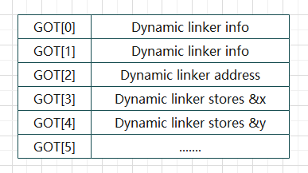

## 位置无关代码（PIC）

> Position-independent code (PIC) is code that uses no hard-coded addresses for either code or data. by using relative addressing

PIC不使用绝对地址对data或者fun进行寻址，而是利用一些相对地址的手段进行，PIC一般而言是针对共享库的。

我们经过前面的学习知道, 一个可执行文件是存在以下两个 `section`的, 分别是 `.text` 和 `.data`

​		在正常情况下, `.text` 是不允许修改的, 而 `.data` 是可以修改的, 但是在代码中, 我们的跳转和引用是需要地址的, 如果是动态加载的话, 如果我们是使用绝对地址进行跳转, 那么每次程序运行的时候, 动态库的地址可能会发生改变, 这样我们在 `.text` 中的地址就要跟着改变, 这是不合理的, 所以我们就要想办法不修改 `.text` 中的代码

​		PIC的一个核心思想是借助**数据段和代码段之间的确定的偏移量**。因为对于链接器而言，在将许多的目标文件进行合并的时候，它明确的知道所有段的大小和他们之间的偏移量。如上图所示，代码段紧跟着数据段，因此任何代码段中的某条指令到数据段起始的偏移量都可以很容易的计算出来，用代码段的大小减去该指令距离代码段起始点的偏移量。


### 全局偏移量表（GOT）

​		`GOT` 中是在`.text` 和 `.data` 层之中的


​		 `GOT` 实际上是一个数组的结构, 每一个 `GOT` 项代表一个地址, `GOT` 是可以进行修改的, 也就是说, 程序的每一次运行, 动态链接器都可以将正确的地址放置在 `GOT `表中,  同是跳转指令通过相对地址的操作就可以定位到一个具体的 `GOT` 项, 从而精确确定一个地址



`GOT` 在 `ELF` 文件中有两个对应的段，分别为 `.got` 和 `.got.plt` ，其实是一个，只不过根据功能的不同，分成了两个：

- `.got` 和 `.got.plt` 紧挨着，一般在汇编代码中，当前 `.text` 中的某条指令 $+$ 一个固定的偏移量会定位到 `.got.plt` 段的起始点；
- `.got` 是为了变量重定位服务，`.got.plt` 为了函数重定位服务；
- 所以，给 `.got.plt` 段起始地址加个正值，对应的就是 `.got.plt` 段，而加个负值，对应的就是 `.got` 段。

我们可以通过以下的命令查看 `GOT` 表

```
[Linux] > objdump -R prog3

prog3：     文件格式 elf64-x86-64

DYNAMIC RELOCATION RECORDS
OFFSET           TYPE              VALUE 
0000000000600ff8 R_X86_64_GLOB_DAT  __gmon_start__
0000000000601018 R_X86_64_JUMP_SLOT  printf@GLIBC_2.2.5
0000000000601020 R_X86_64_JUMP_SLOT  __libc_start_main@GLIBC_2.2.5
0000000000601028 R_X86_64_JUMP_SLOT  addvec
0000000000601030 R_X86_64_JUMP_SLOT  __gmon_start__
```

