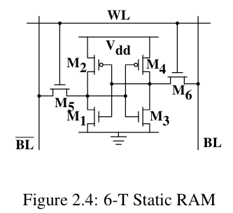
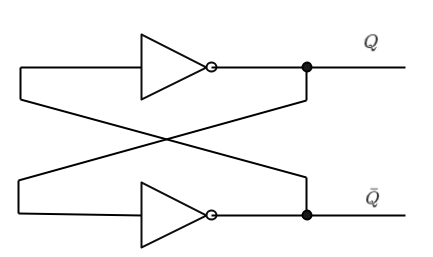
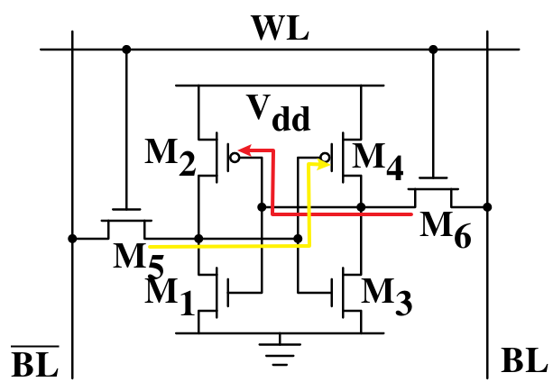

# 从Programmer视角看DRAM和SRAM

## 前言

​		作为一个软件工程专业的学生, `SRAM` 和 `DRAM` 的了解本应该只停留在知道、了解. 因为缺乏相关的专业知识 [像二极管, MOS 管], 想要了解 `SRAM` , `DRAM` 的原理以及他们的区别也就只能停留在死记硬背上了.

​		但事实上不应该如此, 除去知道原理可能让你在吹牛的时候卖弄卖弄自己拙劣的学识、让你在面试的时候多一分筹码和自信, 探索原理本身就是一件有意思的事情, 于是便有了这篇文章

​		阅读本文理论上你只需要高中的物理知识以及可以忽略不计的计算机系统知识

本文参考资料 :

> CMU - CSAPP : 深入理解计算机系统
>
> What Every Programmer Should Know About Memory
>
> B 站视频 : [计算机组成原理之SRAM与DRAM的存储元原理讲解_哔哩哔哩_ bilibili](https://www.bilibili.com/video/BV1Qq4y137pq/?spm_id_from=333.337.search-card.all.click&vd_source=8838e4a19bf1a6234c3eef010864f3cf)

感谢 @L 同学在学习过程中给我的指导和帮助

## 引入

​		我们明白, 计算机存储数据的形式是通过一个又一个 $0$ 和 $1$ 来实现的, 当我们需要某些数据的时候, 再将这些 $0$ 和 $1$ 解码成我们需要的形式, 所以计算机的存储设备都是围绕如何存储 $0$ 和 $1$ 的问题展开的, 包括我们今天要讲的 `DRAM` 和 `SRAM` . 这不免让我们想到, 既然计算机的存储的目的都是一样的, 那么整个计算机其实完全可以只有一种存储结构, 为什么还会有 `SRAM` , `DRAM`, `flash`, 磁盘 等等一些列存储方式呢 ?

正如大家想的一样, 速度和成本是左右存储方式选择的重要原因, 在我们了解相关原理后相信你会有充分的了解

## SRAM 原理

SRAM 的结构图如下所示 : 

### 前置知识介绍

#### 双稳态电路

我们首先先介绍一下 SRAM 的核心结构 : 双稳态电路

我们将高电平设为 $1$ , 低电平设为 $0$ , 那么就有 : 

- $Q$ 置 $1$，那么 $\bar{Q}=0$。这叫做基本双稳态电路的 **$1$ 状态**

- $Q$ 置 $0$ ，那么 $\bar{Q}=1$。这叫做基本双稳态电路的 **$0$ 状态**

该电路拥有$1$ 和 $0$ 两种状态，一旦进入一种状态，将会持续保持。所以它又叫做**双稳态存储电路**。

这便是我们需要知道的知识了, 如果你想了解更多的知识, 可以自行查阅资料或者参考[这个](https://www.bilibili.com/video/BV1dV4y1x7vb/?spm_id_from=333.337.search-card.all.click&vd_source=8838e4a19bf1a6234c3eef010864f3cf)视频

在我们所给的这个 SRAM 图中 ,  红色的线代表 $Q$ , 黄色的线代表 $\bar{Q}$

### 存储原理

