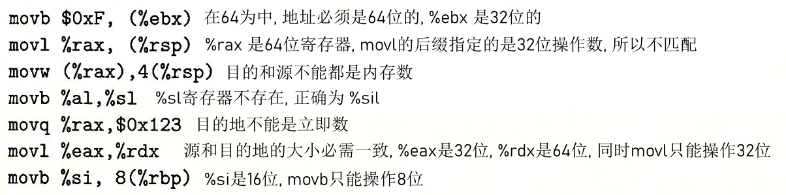

# CSAPP-第三章课堂练习

## 练习 3.1


## 练习 3.2

由上到下依次为 : 

```
movl
movw
movb
movb
movq
movw
```

取两个寄存器所存储位数的最小值即可


## 练习 3.3




## 练习 3.4


## 练习 3.5

```c
void decode1(long* xp, long* yp, long* zp) {
    long a, b, c = *xp, *yp, *zp;
    *yp = a;
    *zp = b;
    *xp = c;
}
```


## 练习 3.6


## 练习 3.7

```c
long scale2(long x, long y, long z) {
    long t = 8 * z + 2 * y + 5 * x;
    return t;
}
```


## 练习 3.8


## 练习 3.9

```assembly
shift_left4_rightn:
	movq	%rdi, %rax
	sal		$4, %rax
	movl	%esi, %ecx
	sarq	%cl, %rax
```


## 练习 3.10

```c
long arith2(long x, long y, long z) {
    long t1 = x | y;
    long t2 = t1 >>= 3;
    long t3 = ~ t2;
    long t4 = z - t3;
    return t4;
}
```


## 练习 3.11

$A :$ 它将 `%rdx` 赋值为 $0$

$B :$ `movq $0, %rdx`

$C :$ 我们编码立即数 $0$ 需要 $8$ 个字节, 而使用异或的方法可以节省这片空间


## 练习 3.12

```assembly
uremdiv:
	movq 	%rdx, %r8
	movq 	%rdi, %rax
	xorl	%edx, %edx
	divq	%rsi
	movq	%rax, (%r8)
	movq	%rdx, (%rcx)
	ret
```


## 练习 3.13

$A :$ 

`data_t` : 	`int` 

`COMP` : 		`<`

$B :$

`data_t` : 	`short`

`COMP` : 		`>=`

$C :$

`data_t` : 	`unsigned char`

`COMP` : 		`<=`

$D :$

`data_t` : 	`long` , `unsigned long` , 指针

`COMP` : 		`!=`


## 练习 3.14

$A :$ 

`data_t` : 	`long` 

`COMP` : 		`>=`

$B :$

`data_t` : 	`short` , `unsigned short`

`COMP` : 		`==`

$C :$

`data_t` : 	`unsigned char`

`COMP` : 		`>`

$D :$

`data_t` : 	`int` 

`COMP` : 		`<=`


## 练习 3.15

$A : \mathrm{0x40 03FE}$ 	$B : \mathrm{0x40 0425}$	

$C: \mathrm{addr_ja = 0x400543\quad addr_{pop} = 0x400545}$	

$D : \mathrm{0x40 0560}$


## 练习 3.16

```c
void cond(long a, long *p) {
    if(!p)
        goto ret;
    if(a <= *p)
        goto ret;
    *p = a;
    return;
ret:
    return;
}
```


## 练习 3.17

```c
int xLarge = 0, yLarge = 0;
long absdiff_se(long x, long y) {
    bool t = x < y;
    if(t)
        goto True;
    xLarge ++;
    return x - y;
True:
    yLarge ++;
    return y - x;
}
```


## 练习 3.18

```c
long test(long x, long y, long z) {
    long val = x + y + z;
    if(x < -3) {
        if(y >= z) 
            val = y * z;
        else 
            val = x * y;
    }else if(x > 2)
        val = x * z;
    return val;
}
```


## 练习 3.19

$A :$  根据题目可知 : $T_{ok} = 16, T_{ran} = 31$

由等式 : $T_{ran} = T_{avg}(0.5) = T_{ok} + 0.5\cdot T_{mp} \Rightarrow 31 = 16 + 0.5 \cdot T_{mp} \Rightarrow T_{mp} = 30$

$B :$ 需要 $16+30=46$ 个时钟周期


## 练习 3.20

$A :$  $OP$ 操作为除法操作, 第一步的 `leap` 为增加偏置操作

$B :$

```assembly
arith:
	leap	7(%rdi), %rax		# %rax = 7 + x
	testq	%rdi, %rdi			# check x if less then 0
	cmovns	%rdi, %rax			# if x less then 0, %rax = x
	sarq	$3, %rax			# %rax >>_a 3
	ret
```


## 练习 3.21

```c
long test(long x, long y) {
    long val = 8 * x;
    if(y > 0) {
        if(x >= y)
            val = x & y;
        else
            val = y - x;
    }else if(y <= -2) 
        val = x + y;
    return val;
}
```


## 练习 3.22

$A : 13!$		$B:20!$


## 练习 3.23

```assembly
dw_loop:
	movq	%rdi, %rax		# ret = x;
	movq 	%rdi, %rcx		# %rcx = x;
	imulq	%rdi, %rcx		# %rcx *= x; %rcx = x^2
	leaq	(%rdi, %rdi), %rdx	# %rdx = x + x = 2x
.L2:
	leaq	1(%rcx, %rax), %rax	# ret = ret + %rcx + 1 => ret += x^2 + 1
	subq	$1, %rdx		# %rdx -= 1
	testq	%rdx, %rdx		
	jg		.L2				# %rdx > 0, loop
```

$A :$ 	`x : %rax,	y : %rcx,	n : %rdx`

$B:$ 	通过 `leap` 指令实现加一操作


## 练习 3.24

```c
long loop_while(long a, long b) {
    long result = 1;
    while(a < b) {
        result = result * (a + b);
        a ++ ;
    }
    return result;
}
```


## 练习 3.25

```c
long loop_while2(long a, long b) {
    long result = b;
    while(b > 0) {
        result = result * a;
        b = b - a;
    }
}
```


## 练习 3.26

$A :$ 发现了直接跳转指令, 确定是 `jump to middle`

$B :$

```c
long fun_a(unsigned long x) {
    long val = 0;
    while(x != 0) {
        val ^= x;
        x >>= 1;
    }
    return val & 1;
}
```

$C :$ 判断输入的二进制表示中一的个数是奇数还是偶数, 奇数返回1,  偶数返回0


## 练习 3.27

```c
long face_for_guard_goto(long n) {
    long i = 2;
    long result = 1;
    if(i > n)
        goto done;
loop:
    result *= i;
    i++;
test:
    if(i <= n)
        goto loop;
done:
    return result;
}
```


## 练习 3.28

$A :$

```c
long fun_b(unsigned long x) {
    long val = 0;
    long i;
    for(i = 64; i != 0 ; i--) {
        int tem = x & 1;
        val += val;
        val |= tem;
        x >>= 1;
    }
}
```

$B :$ 因为一定满足

$C :$ 反转一个数字的二进制表示

 

## 练习 3.29

$A :$ 更新语句将无法执行从而造成死循环

$B:$ 专门构造一个 update 快, 然后跳转到那里


## 练习 3.30

$A :$ $-1, 0, 1,2, 4, 5, 7$

$B :$ .L5 标号为  $1, 7$ , .L7 的标号为 $2, 4$


## 练习 3.31

```c
void switcher(long a, long b, long c, long *dest) {
    long val;
    switch(a) {
        case 5:
            c = b ^ 15;
        case 0:
            val = c + 112;
            break;
        case 2:
        case 7:
            val = (b + c) << 2;
        case 4:
            val = a;
            break;
        default:
            val = b;
    }
    *dest = val;
}
```


## 练习 3.32


## 练习 3.33

u 为 long 的指针, v为 char 的指针, a 为 int, b 为 short


## 练习 3.34

